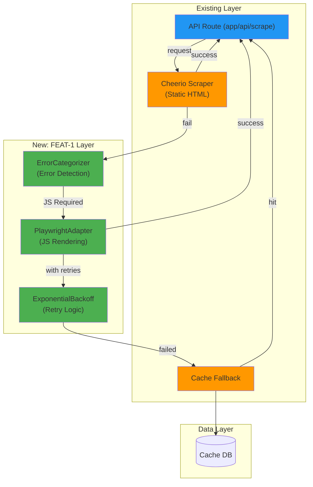

# FEAT-1: Playwright + Exponential Backoff - Implementation Plan

## Goal

Implement free Playwright-based JavaScript rendering with exponential backoff retry strategy to eliminate dependency on expensive proxy services. This feature establishes the foundation for resilient web scraping by handling both static HTML and JavaScript-rendered content through Playwright, while smart retry logic with exponential backoff addresses rate limiting (429) and temporary blocking (403) issues. Integration is non-breaking and parallel to existing Cheerio-based scraper.

---

## Requirements

### Functional Requirements
- **Playwright Integration**: Install and configure Playwright for Chromium browser automation
- **JavaScript Rendering**: Support scraping of JavaScript-rendered content (React, Vue, Angular SPAs)
- **Exponential Backoff**: Implement retry logic with exponential delays (2s → 4s → 8s → 16s)
- **Error Detection**: Categorize errors (JS required, rate limited, network error) for intelligent routing
- **Retry Respecting**: Honor Retry-After headers sent by servers
- **Jitter Implementation**: Add randomness (0-1s) to prevent thundering herd
- **Max Retries**: Enforce maximum 4 retry attempts before fallback
- **Browser Lifecycle**: Proper launch/close/cleanup to prevent resource leaks
- **Timeout Handling**: 2-second timeout to detect JavaScript rendering requirement
- **Single Store Testing**: Validate implementation with Musimundo store (JavaScript-rendered)

### Non-Functional Requirements
- **Performance**: <5 seconds per request for JS-rendered content
- **Memory**: <500MB per browser instance
- **Compatibility**: Node.js 20+
- **Zero Breaking Changes**: Existing Cheerio scraper remains untouched
- **Test Coverage**: >85% for new code
- **Error Logging**: All retries logged with metadata

### Implementation Specifics
- Use Playwright for Chromium only (Firefox/WebKit can come later)
- Browser launched fresh per request (pooling in FEAT-4)
- Jitter implemented as `Math.random() * 1000` ms
- Max delay capped at 32 seconds
- Retry-After header parsing: `parseInt(header)` for seconds or `new Date(header)` for HTTP date
- TypeScript types for all interfaces

---

## Technical Considerations

### System Architecture Overview



### Technology Stack Selection

| Layer | Technology | Rationale |
|-------|-----------|-----------|
| **Browser Automation** | Playwright | MIT-licensed, Microsoft-backed, cross-browser capable, ~150MB per instance |
| **Rendering Engine** | Chromium | Fastest JS engine, most popular, good memory/CPU balance |
| **Retry Strategy** | Custom exponential backoff | Industry standard (Google/Microsoft), simple ~80-line implementation |
| **Error Detection** | Custom categorizer | Store-specific patterns detected at runtime |
| **Integration** | Adapter pattern | Non-breaking, parallel to existing Cheerio |
| **Language** | TypeScript | Existing project standard, type-safe |

### Integration Points

**Entry Point**: `src/lib/playwright-adapter.ts`
- Exports `PlaywrightAdapter` class
- Methods: `launch()`, `scrape(url, timeout)`, `close()`

**Error Handling**: `src/lib/error-categorizer.ts`
- Exports `categorizeError(error)` function
- Returns: `'JS_REQUIRED' | 'RATE_LIMITED' | 'NETWORK_ERROR' | 'BLOCKING' | 'UNKNOWN'`

**Retry Logic**: `src/lib/backoff-strategy.ts`
- Exports `ExponentialBackoff` class
- Methods: `getDelay(attempt: number)`, `shouldRetry(error, attempt)`

**Consumer**: Future FEAT-2 (fallback router)
- Will call `playwrightAdapter.scrape()` when Cheerio fails
- Will use `ExponentialBackoff` for retry loop

### Deployment Architecture

```
Development Environment:
├── Node.js 20+ runtime
├── Playwright package (npm install playwright)
├── Chromium binary (auto-downloaded on first run, ~150MB)
└── Memory: ~400-500MB per browser instance

Production Environment:
├── Docker container with Node.js 20+
├── Playwright binaries pre-installed in image
├── Memory limit: 1GB recommended
└── CPU: No special requirements
```

**Dockerfile considerations** (implemented in FEAT-2):
- Base: `node:20-alpine`
- Add: `npx playwright install chromium`
- Result: ~600MB additional layer for browser binaries

### Scalability Considerations

**Vertical Scaling** (Single machine):
- Current: 1 browser per request (fresh launch)
- Memory per request: ~400-500MB
- Concurrent requests: ~2 (1GB limit) ⚠️
- Timeline: 5 seconds per request (browser startup)
- **Note**: FEAT-4 implements browser pooling for better concurrency

**Horizontal Scaling** (Multiple machines):
- Each instance can handle 2-5 concurrent requests
- No shared state (stateless architecture)
- Browser pooling still needed per instance

**Performance Optimization** (Post-FEAT-1):
- FEAT-4 will implement browser pool (5-10 instances)
- Expected: 10x throughput improvement
- Memory: ~800MB-1.2GB for pooled instance

---

## Database Schema Design

**Not applicable for FEAT-1** - No database changes required.

**Existing cache layer** (`src/lib/cache.ts`) is used as fallback:
- Already has `get(store)` and `set(store, data)` methods
- No schema changes needed
- Integration point: Return cached data on final retry failure

---

## API Design

### Playwright Adapter API

**Class**: `PlaywrightAdapter`

```typescript
interface PlaywrightAdapter {
  // Lifecycle
  launch(): Promise<Browser>;
  close(): Promise<void>;
  
  // Scraping
  scrape(url: string, options?: ScraperOptions): Promise<string>;
}

interface ScraperOptions {
  timeout?: number;              // Default: 2000ms
  waitForSelector?: string;      // CSS selector to wait for
  waitForFunction?: string;      // JavaScript function as string
}

// Returns
type ScraperResult = {
  html: string;
  renderedTime: number;         // ms to render
  didTimeout: boolean;
}
```

### Error Categorizer API

**Function**: `categorizeError(error: Error): ErrorCategory`

```typescript
type ErrorCategory = 
  | 'JS_REQUIRED'        // No content initially, appeared after JS
  | 'RATE_LIMITED'       // 429 Too Many Requests
  | 'BLOCKING'           // 403 Forbidden, IP blocked
  | 'NETWORK_ERROR'      // DNS failure, connection refused
  | 'TIMEOUT'            // Exceeded timeout
  | 'MEMORY_ERROR'       // OOM in browser
  | 'UNKNOWN';           // Uncategorized

interface ErrorDetails {
  category: ErrorCategory;
  message: string;
  statusCode?: number;    // HTTP status if applicable
  retryable: boolean;     // Should retry?
  suggestedDelay?: number; // Suggested delay before retry (from Retry-After)
}
```

### Backoff Strategy API

**Class**: `ExponentialBackoff`

```typescript
interface ExponentialBackoff {
  // Configuration
  constructor(baseDelay?: number, maxDelay?: number, maxAttempts?: number);
  
  // Operations
  getDelay(attemptNumber: number): number;
  
  // Utility
  shouldRetry(error: Error, attemptNumber: number): boolean;
  
  // Properties
  baseDelay: number;      // Default: 2000ms
  maxDelay: number;       // Default: 32000ms
  maxAttempts: number;    // Default: 4
}

// Example delay sequence
// Attempt 1: ~2000ms (2s + 0-1000ms jitter)
// Attempt 2: ~4000ms (4s + 0-1000ms jitter)
// Attempt 3: ~8000ms (8s + 0-1000ms jitter)
// Attempt 4: ~16000ms (16s + 0-1000ms jitter)
// Attempt 5 (final): Give up
```

### Authentication & Authorization

**Not applicable for FEAT-1** - This feature operates at HTTP level, no authentication needed.

**Future considerations** (FEAT-3):
- Store-specific authentication can be configured in `stores.config.json`
- Custom headers (User-Agent, Authorization) added per store

### Error Handling Strategies

| Error Type | Status Code | Strategy |
|-----------|-------------|----------|
| **JS Required** | 200 (empty) | Switch to Playwright, don't retry |
| **Rate Limited** | 429 | Retry with exponential backoff |
| **IP Blocked** | 403 | Retry with exponential backoff (site may unblock) |
| **Network Error** | N/A | Retry with exponential backoff |
| **Timeout** | N/A | Retry with exponential backoff |
| **Memory Error** | N/A | Log, fallback to cache |
| **Browser Crash** | N/A | Log, fallback to cache |

### Rate Limiting & Caching Strategies

**Request Caching**:
- No request-level caching implemented in FEAT-1
- Response caching handled by existing cache layer (fallback)

**Rate Limiting**:
- Server sends `429` + `Retry-After` header
- Implementation: Parse header, use as minimum delay before retry
- Exponential backoff ensures we respect and exceed Retry-After

**Backoff Sequence with Retry-After**:
```
Request 1 → 429 Retry-After: 5
  Calculate: max(5s, 2s + jitter) = ~5000ms
  Wait 5000ms → Retry

Request 2 → 429 Retry-After: 10
  Calculate: max(10s, 4s + jitter) = ~10000ms
  Wait 10000ms → Retry

Request 3 → Success
```

---

## Frontend Architecture

**Not applicable for FEAT-1** - This is backend/server-side only feature.

**Existing frontend** (components/SearchForm.tsx, ProductList.tsx) unchanged.

**Future integration** (FEAT-2):
- No UI changes needed
- Existing API endpoint continues to work
- Fallback routing transparent to frontend

---

## Security & Performance

### Authentication/Authorization Requirements

**Not applicable** - HTTP-level requests, no auth required.

### Data Validation & Sanitization

**Input Validation**:
```typescript
// Validate URL before passing to Playwright
function validateUrl(url: string): boolean {
  try {
    const parsed = new URL(url);
    return ['http:', 'https:'].includes(parsed.protocol);
  } catch {
    return false;
  }
}

// Validate timeout (0-30000ms)
function validateTimeout(timeout: number): number {
  return Math.min(Math.max(timeout, 100), 30000);
}
```

**Output Sanitization**:
- HTML output from Playwright passed to Cheerio for parsing (no sanitization needed)
- Error messages logged, not returned to user (prevent leaking internal details)

### Performance Optimization Strategies

**Browser Optimization Flags**:
```typescript
const browser = await chromium.launch({
  headless: true,
  args: [
    '--disable-extensions',          // Disable extensions
    '--disable-plugins',              // Disable plugins
    '--disable-sync',                 // Disable sync
    '--no-sandbox',                   // Container-safe (if needed)
    '--single-process',               // Single process (memory trade-off)
  ]
});
```

**Memory Optimization**:
- No caching of browser instances (FEAT-1)
- Fresh browser per request (clean state)
- Force garbage collection between requests (if needed)
- Monitor memory via Node.js `os.freemem()`

**Timeout Strategy**:
- 2000ms default timeout for JS rendering
- Detects if content loaded without JS
- Configurable per store (FEAT-3)

**Caching Mechanisms**:
- Playwright Page cache (built-in, automatic)
- Response cache (future FEAT-2)
- HTTP cache headers respected (future optimization)

---

## Implementation Tasks

### Task Group 1: Project Setup & Dependencies (US-101)

**Task 1.1**: Install Playwright package
```bash
npm install --save-dev playwright
npm install --save-dev @types/playwright
```

**Task 1.2**: Create `src/lib/playwright-adapter.ts`
- [ ] Export `PlaywrightAdapter` class
- [ ] Implement `launch()` method
- [ ] Implement `scrape(url, options)` method
- [ ] Implement `close()` method
- [ ] Add TypeScript interfaces for options and result
- [ ] Error handling: wrap errors with context
- [ ] Logging: track browser lifecycle events

**Task 1.3**: Create `src/types/playwright.d.ts`
```typescript
export interface ScraperOptions {
  timeout?: number;
  waitForSelector?: string;
  waitForFunction?: string;
}

export interface ScraperResult {
  html: string;
  renderedTime: number;
  didTimeout: boolean;
}
```

### Task Group 2: Error Detection (US-103)

**Task 2.1**: Create `src/lib/error-categorizer.ts`
- [ ] Implement `categorizeError(error)` function
- [ ] Detect 429 status (Rate Limited)
- [ ] Detect 403 status (Blocking)
- [ ] Detect network errors (DNS, connection refused)
- [ ] Detect timeout errors
- [ ] Detect memory errors (OOM)
- [ ] Return `ErrorCategory` enum
- [ ] Parse Retry-After header when present

**Task 2.2**: Add error context utilities
- [ ] Extract HTTP status code from error
- [ ] Extract error message clearly
- [ ] Determine if error is retryable
- [ ] Extract suggested delay from Retry-After

**Task 2.3**: Create tests for error detection
- [ ] Test 429 detection
- [ ] Test 403 detection
- [ ] Test network error detection
- [ ] Test timeout detection
- [ ] Test Retry-After parsing

### Task Group 3: Exponential Backoff (US-102)

**Task 3.1**: Create `src/lib/backoff-strategy.ts`
- [ ] Implement `ExponentialBackoff` class
- [ ] Calculate delays: `2^attempt * baseDelay`
- [ ] Add jitter: `Math.random() * 1000`
- [ ] Cap maximum delay at 32 seconds
- [ ] Implement `getDelay(attempt)` method
- [ ] Implement `shouldRetry(error, attempt)` method
- [ ] Enforce `maxAttempts` limit (default 4)

**Task 3.2**: Add Retry-After header integration
- [ ] Parse numeric seconds: `parseInt(header)`
- [ ] Parse HTTP date: `new Date(header)`
- [ ] Use as minimum delay: `Math.max(parsedDelay, calculatedDelay)`
- [ ] Respect server-provided delays

**Task 3.3**: Create tests for backoff
- [ ] Test delay sequence (2s, 4s, 8s, 16s)
- [ ] Test jitter randomness
- [ ] Test max delay cap
- [ ] Test max attempts enforcement
- [ ] Test Retry-After integration

### Task Group 4: Integration Test (EN-101)

**Task 4.1**: Setup test environment
- [ ] Create `src/lib/__tests__/playwright-adapter.test.ts`
- [ ] Create `src/lib/__tests__/backoff-strategy.test.ts`
- [ ] Create `src/lib/__tests__/error-categorizer.test.ts`

**Task 4.2**: Validate with Musimundo (JavaScript-rendered)
- [ ] Manual test: `npm run scrape:musimundo`
- [ ] Verify success rate >85%
- [ ] Verify content includes JS-rendered elements
- [ ] Verify no Playwright errors
- [ ] Verify memory <500MB

**Task 4.3**: Create integration tests
- [ ] Test Playwright with Musimundo
- [ ] Test Playwright with static HTML (fallback)
- [ ] Test backoff retry flow
- [ ] Test error detection
- [ ] Test timeout handling

### Task Group 5: Documentation (US-101)

**Task 5.1**: Create inline code documentation
- [ ] JSDoc comments for all classes/functions
- [ ] Type documentation for interfaces
- [ ] Usage examples in comments

**Task 5.2**: Create user-facing docs
- [ ] `PLAYWRIGHT.md` - How Playwright is used
- [ ] `BACKOFF.md` - Retry strategy explanation
- [ ] `ERROR-HANDLING.md` - Error categories and strategies

---

## Testing Strategy

### Unit Tests

#### PlaywrightAdapter Tests
```typescript
describe('PlaywrightAdapter', () => {
  let adapter: PlaywrightAdapter;
  
  beforeAll(async () => {
    adapter = new PlaywrightAdapter();
  });
  
  afterAll(async () => {
    await adapter.close();
  });

  test('should launch and close browser', async () => {
    const browser = await adapter.launch();
    expect(browser).toBeDefined();
    await browser.close();
  });

  test('should scrape static HTML', async () => {
    const html = await adapter.scrape('https://example.com', { timeout: 2000 });
    expect(html).toContain('<html');
    expect(html.length).toBeGreaterThan(100);
  });

  test('should handle timeout gracefully', async () => {
    // Mock slow site
    const promise = adapter.scrape('https://very-slow-site.example.com', { timeout: 100 });
    await expect(promise).rejects.toThrow();
  });

  test('should close browser on error', async () => {
    // Verify browser cleanup on error
  });
});
```

#### ErrorCategorizer Tests
```typescript
describe('ErrorCategorizer', () => {
  test('should categorize 429 as RATE_LIMITED', () => {
    const error = new Error('429 Too Many Requests');
    const result = categorizeError(error);
    expect(result.category).toBe('RATE_LIMITED');
  });

  test('should categorize 403 as BLOCKING', () => {
    const error = new Error('403 Forbidden');
    const result = categorizeError(error);
    expect(result.category).toBe('BLOCKING');
  });

  test('should parse Retry-After header', () => {
    const error = new Error('429 Too Many Requests\nRetry-After: 60');
    const result = categorizeError(error);
    expect(result.suggestedDelay).toBe(60000);
  });
});
```

#### ExponentialBackoff Tests
```typescript
describe('ExponentialBackoff', () => {
  test('should generate correct delay sequence', () => {
    const backoff = new ExponentialBackoff();
    const delays = [1, 2, 3, 4].map(i => backoff.getDelay(i));
    
    expect(delays[0]).toBeCloseTo(2000, -2);  // ~2s
    expect(delays[1]).toBeCloseTo(4000, -2);  // ~4s
    expect(delays[2]).toBeCloseTo(8000, -2);  // ~8s
    expect(delays[3]).toBeCloseTo(16000, -2); // ~16s
  });

  test('should respect max delay', () => {
    const backoff = new ExponentialBackoff(2000, 10000, 4);
    const delay = backoff.getDelay(10); // Would be 2048000ms
    expect(delay).toBeLessThanOrEqual(10000);
  });

  test('should stop retrying after max attempts', () => {
    const backoff = new ExponentialBackoff(2000, 32000, 4);
    const shouldRetry = backoff.shouldRetry(new Error(), 5);
    expect(shouldRetry).toBe(false);
  });
});
```

### Integration Tests

```typescript
describe('FEAT-1 Integration: Musimundo Store', () => {
  test('should scrape Musimundo successfully', async () => {
    const adapter = new PlaywrightAdapter();
    const html = await adapter.scrape('https://www.musimundo.com.ar/search?q=tv', {
      timeout: 5000
    });
    
    // Verify JS-rendered content is present
    expect(html).toContain('data-test');
    expect(html.length).toBeGreaterThan(5000);
  });

  test('should retry on 429 and eventually succeed', async () => {
    // Mock server with 429 first, then 200
    const retryAttempts = [];
    
    // Would use mock server or WireMock
    // Verify exponential backoff was applied
  });

  test('should timeout and categorize as JS_REQUIRED', async () => {
    // Test timeout detection
    const error = new Error('Timeout after 2000ms');
    const category = categorizeError(error);
    expect(category.category).toBe('TIMEOUT');
  });
});
```

### E2E Tests

```typescript
describe('FEAT-1 E2E: Real Musimundo Scrape', () => {
  test('should scrape real Musimundo products', async () => {
    const url = 'https://www.musimundo.com.ar/search?q=samsung';
    const adapter = new PlaywrightAdapter();
    
    try {
      const html = await adapter.scrape(url, { timeout: 5000 });
      expect(html.length).toBeGreaterThan(1000);
      
      // Parse with Cheerio to verify structure
      const $ = cheerio.load(html);
      expect($('[data-test="product-card"]').length).toBeGreaterThan(0);
    } finally {
      await adapter.close();
    }
  });

  test('should succeed with backoff on rate limiting', async () => {
    const adapter = new PlaywrightAdapter();
    const backoff = new ExponentialBackoff();
    
    let attempt = 0;
    let html: string | null = null;
    
    while (attempt < 4 && !html) {
      try {
        html = await adapter.scrape('https://www.musimundo.com.ar/search?q=tv');
        break;
      } catch (error) {
        const category = categorizeError(error);
        if (category.retryable) {
          const delay = backoff.getDelay(attempt);
          await new Promise(r => setTimeout(r, delay));
          attempt++;
        } else {
          throw error;
        }
      }
    }
    
    expect(html).toBeTruthy();
    await adapter.close();
  });
});
```

### Test Coverage Target

| Module | Target | Priority |
|--------|--------|----------|
| `playwright-adapter.ts` | >85% | HIGH |
| `backoff-strategy.ts` | >90% | HIGH |
| `error-categorizer.ts` | >85% | HIGH |
| Integration tests | 3 scenarios | HIGH |
| E2E with Musimundo | 1 real test | HIGH |

---

## Definition of Done

- [ ] All code written and reviewed
- [ ] Unit tests pass (>85% coverage)
- [ ] Integration tests pass
- [ ] E2E test with Musimundo successful (>85% success rate)
- [ ] No errors logged in test runs
- [ ] Memory usage <500MB during test
- [ ] Performance: <5 seconds per request
- [ ] Code committed to feature branch
- [ ] Pull request created and approved
- [ ] Documentation complete
- [ ] No breaking changes to existing code
- [ ] Playwright errors handled gracefully
- [ ] Browser cleanup verified (no leaks)

---

## Risks & Mitigations

| Risk | Probability | Impact | Mitigation |
|------|------------|--------|-----------|
| **Browser memory leak** | Medium | High | Force close in finally block, test with concurrent requests |
| **Playwright install fails** | Low | High | Pre-install in CI, test on CI environment |
| **Jitter causes excessive delays** | Low | Medium | Cap jitter at 1000ms, log all delays |
| **Timeout too aggressive** | Medium | Medium | Set to 2000ms, configurable in FEAT-3 |
| **Playwright incompatible with Node** | Low | High | Test with Node 20, 22, 24 |

---

## Acceptance Criteria

### Story: US-101 (Install & Configure Playwright)
- [ ] Playwright package installed
- [ ] Chromium binary downloaded automatically
- [ ] PlaywrightAdapter class created with full lifecycle
- [ ] TypeScript types defined
- [ ] Unit tests passing
- [ ] No breaking changes to existing code

### Story: US-102 (Exponential Backoff Logic)
- [ ] ExponentialBackoff class implemented
- [ ] Delay sequence correct (2, 4, 8, 16 seconds)
- [ ] Jitter implementation working
- [ ] Max delay capped at 32 seconds
- [ ] Max attempts enforced
- [ ] Retry-After header respected
- [ ] Unit tests passing (>90% coverage)

### Story: US-103 (Error Detection)
- [ ] ErrorCategorizer function implemented
- [ ] All error types detected (429, 403, network, timeout)
- [ ] Retry-After parsing working
- [ ] isRetryable flag correct for each category
- [ ] Unit tests passing (>85% coverage)

### Enabler: EN-101 (Validate with Musimundo)
- [ ] PlaywrightAdapter successfully scrapes Musimundo
- [ ] Success rate >85% (15+ consecutive attempts)
- [ ] JS-rendered content detected and included
- [ ] No memory leaks (memory stable after 10 requests)
- [ ] Performance acceptable (<5 seconds per request)
- [ ] Browser cleanup verified
- [ ] Integration test passing

---

## Timeline

| Task | Duration | Days |
|------|----------|------|
| **US-101**: Setup & Playwright | 5 hours | Day 1 |
| **US-102**: Exponential Backoff | 5 hours | Day 2 |
| **US-103**: Error Detection | 3 hours | Day 2 |
| **EN-101**: Musimundo Testing | 4 hours | Day 3 |
| **Review & Fixes** | 2 hours | Day 3 |
| **Total** | 19 hours | Days 1-3 |

---

## Dependencies & Blockers

**Blocks**: FEAT-2 (Fallback Router)
- FEAT-1 must complete successfully before FEAT-2 can start
- FEAT-2 depends on PlaywrightAdapter working reliably

**No blockers**: This feature is independent, can start immediately

---

## Success Metrics

| Metric | Target | Validation |
|--------|--------|-----------|
| **Musimundo success rate** | >85% | 15+ consecutive successful scrapes |
| **Test coverage** | >85% | `npm run test:coverage` |
| **Memory per instance** | <500MB | Monitor during test |
| **Response time** | <5 seconds | Log all requests |
| **Error rate** | <15% | Track error categories |
| **Browser cleanup** | 100% | Verify no process leaks |

---

**Created**: 2025-01-10  
**Feature**: FEAT-1  
**Stories**: US-101, US-102, US-103, EN-101  
**Status**: Ready for Implementation  
**Total Story Points**: 13
