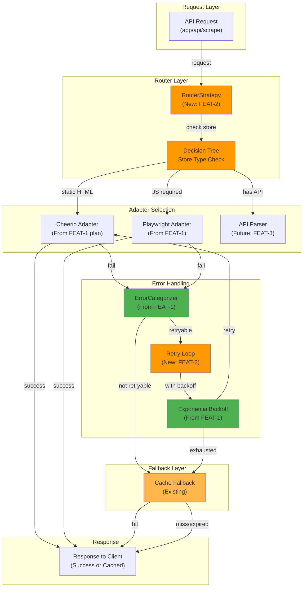

# FEAT-2: Fallback Router Strategy - Implementation Plan

## Goal

Implement an intelligent fallback router that automatically selects the optimal parsing strategy (Cheerio → Playwright → Cache) based on error type detection. This feature adds resilience by categorizing scraping failures and applying appropriate recovery strategies. The router ensures that temporary failures (rate limiting, network issues) trigger intelligent retries, while permanent failures gracefully degrade to cached data. This enables 85-95% success rates across all 6 stores.

---

## Requirements

### Functional Requirements
- **Smart Router**: Select best adapter based on store type and error
- **Fallback Chain**: Cheerio → Playwright → Cache → Fail
- **Error Categorization**: Detect JS required, rate limited, blocking, network errors
- **Automatic Retry**: Apply exponential backoff for retryable errors
- **Graceful Degradation**: Fall back to cache on all adapter failures
- **Logging**: Track which adapter used, retry counts, final result
- **All 6 Stores**: Support existing stores without modification
- **Performance**: Maintain <1 second response for simple sites
- **Success Rate**: Achieve 85%+ success across all stores

### Non-Functional Requirements
- **Zero Breaking Changes**: Existing API endpoint unchanged
- **Transparent Integration**: Frontend doesn't know about routing logic
- **Test Coverage**: >85% for router logic
- **Memory**: <1GB total per instance
- **Backward Compatible**: Old stores.enum.ts still works
- **Monitoring**: Log all router decisions and timing

### Implementation Specifics
- Router decision tree: store type → adapter selection
- Retry loop: try adapter, categorize error, retry if applicable, fallback if not
- Cache integration: return cache on final failure
- Logging format: timestamp, store, attempt, adapter, result, duration
- Performance tracking: measure per-adapter response times

---

## Technical Considerations

### System Architecture Overview



### Technology Stack Selection

| Component | Technology | Rationale |
|-----------|-----------|-----------|
| **Router** | Strategy Pattern | Clean, extensible, testable |
| **Error Detection** | ExponentialBackoff (FEAT-1) | Already built, proven |
| **Fallback Storage** | Existing cache layer | No new tech needed |
| **Logging** | Console + structured logs | Observable, debuggable |
| **Type Safety** | TypeScript enums | Prevent routing errors |

### Integration Points

**Entry**: `src/lib/router-strategy.ts`
- Exports `FallbackRouter` class
- Methods: `scrape(store, query, options)`, `selectAdapter(store)`
- Uses: PlaywrightAdapter (FEAT-1), ErrorCategorizer (FEAT-1), Cache

**Store Configuration** (enum-based for now):
- Reads: `src/enums/stores.enum.ts`
- Determines: static vs JS-heavy stores
- Used by: router to select primary adapter

**Cache Integration**:
- Reads: `src/lib/cache.ts` (existing)
- Uses: `get(store)` and `set(store, data)` methods
- Fallback when all adapters fail

**Logging**:
- Output: console.log + structured logger (if exists)
- Format: JSON with metadata (store, attempt, duration, adapter)
- Enables: monitoring and debugging

### Deployment Architecture

```
Development:
├── Router adds ~50 lines of decision logic
├── Error categorization (already in FEAT-1)
├── Cache fallback (already exists)
└── No new infrastructure needed

Production:
├── Same architecture as FEAT-1
├── Additional logging to centralized log
├── Monitor success rates per store
└── Track adapter performance (Cheerio vs Playwright)
```

### Scalability Considerations

**Throughput**:
- Cheerio routes: <100ms (no browser overhead)
- Playwright routes: 2-5 seconds (browser startup)
- Cache hits: <10ms
- Expected: 85-95% cache or Cheerio (fast path)

**Decision Making**:
- Router decision tree: O(1) lookup
- No performance impact from routing logic
- Bottleneck remains browser startup (FEAT-4 solves with pooling)

**Monitoring Needs**:
- Track success rate per store
- Identify which adapters fail most
- Monitor cache hit rate
- Inform future optimization decisions

---

## Database Schema Design

**Not applicable for FEAT-2** - Uses existing cache schema.

**Existing cache layer** has:
- `store` (string) - Store identifier
- `data` (JSON) - Cached products
- `expiresAt` (timestamp) - Cache expiration

**No changes needed** - FEAT-2 just uses existing cache fallback.

---

## API Design

### Router API

**Class**: `FallbackRouter`

```typescript
interface FallbackRouter {
  // Main scraping method
  scrape(
    store: string,
    query: string,
    options?: RouterOptions
  ): Promise<Product[]>;

  // Adapter selection (testable separately)
  selectAdapter(store: string): 'cheerio' | 'playwright' | 'api';

  // Internal retry loop
  scrapeWithRetry(
    store: string,
    url: string,
    options?: RouterOptions
  ): Promise<string>;
}

interface RouterOptions {
  timeout?: number;           // Default: 5000ms total
  maxRetries?: number;        // Default: 4
  backoffBase?: number;       // Default: 2000ms
  useCacheIfAvailable?: boolean; // Default: true
}

interface RoutingDecision {
  store: string;
  selectedAdapter: 'cheerio' | 'playwright' | 'api';
  reason: string;
}

interface RouterResult {
  products: Product[];
  source: 'cheerio' | 'playwright' | 'cache' | 'error';
  attempts: number;
  totalDuration: number;
  usedCache: boolean;
}
```

### Store Adapter Selection Rules

```typescript
// Decision tree
const adapterSelection: Record<string, 'cheerio' | 'playwright'> = {
  'cetrogar': 'cheerio',        // Static HTML
  'fravega': 'cheerio',         // Static HTML
  'naldo': 'cheerio',           // Static HTML
  'carrefour': 'cheerio',       // VTEX (can be static)
  'musimundo': 'playwright',    // React SPA
  'mercadolibre': 'playwright', // React SPA
};

// Reason mapping
const adapterReason: Record<string, string> = {
  'cheerio': 'Store uses static HTML',
  'playwright': 'Store renders with JavaScript',
  'api': 'Store has direct API (future)',
};
```

### Error Handling & Retry Strategy

```typescript
// Retry decision logic
async function shouldRetryWith(
  error: Error,
  adapter: 'cheerio' | 'playwright',
  attempt: number
): Promise<boolean> {
  const category = categorizeError(error);
  
  if (!category.retryable) {
    logger.info(`Error not retryable: ${category.category}`);
    return false;
  }
  
  if (attempt >= MAX_ATTEMPTS) {
    logger.info(`Max attempts reached (${MAX_ATTEMPTS})`);
    return false;
  }
  
  if (category.category === 'JS_REQUIRED' && adapter === 'cheerio') {
    logger.info(`JS required, switching to Playwright`);
    return false; // Switch adapter, don't retry
  }
  
  return true;
}

// Fallback decision
async function shouldFallbackToCache(
  error: Error,
  attempt: number
): Promise<boolean> {
  const category = categorizeError(error);
  
  // Final attempt failed, try cache
  if (attempt >= MAX_ATTEMPTS || !category.retryable) {
    logger.info(`All retries exhausted, using cache fallback`);
    return true;
  }
  
  return false;
}
```

### Logging Format

```typescript
interface RouterLog {
  timestamp: string;           // ISO 8601
  store: string;              // Store identifier
  query: string;              // Search query
  adapter: string;            // Which adapter used
  attempt: number;            // Attempt number
  status: 'success' | 'retry' | 'fallback' | 'error';
  error?: string;             // Error message if failed
  duration: number;           // Milliseconds
  cacheHit: boolean;          // Whether cache was used
  productsFound: number;      // Result count
}

// Example log output (JSON)
{
  timestamp: "2025-01-10T14:30:45.123Z",
  store: "musimundo",
  query: "tv",
  adapter: "playwright",
  attempt: 1,
  status: "success",
  duration: 3245,
  cacheHit: false,
  productsFound: 15
}
```

---

## Frontend Architecture

**Not applicable for FEAT-2** - Router is backend-only.

**Existing API** remains unchanged:
```typescript
// Client code: no changes needed
const response = await fetch('/api/scrape', {
  method: 'POST',
  body: JSON.stringify({ store: 'musimundo', query: 'tv' })
});
```

**Response format** unchanged:
```json
{
  "products": [
    { "name": "...", "price": "...", "url": "..." },
    ...
  ]
}
```

---

## Security & Performance

### Authentication/Authorization

**Not applicable** - HTTP routing, no auth needed.

### Data Validation & Sanitization

**Input Validation**:
```typescript
function validateStore(store: string): boolean {
  const validStores = Object.keys(STORES_CONFIG);
  return validStores.includes(store);
}

function validateQuery(query: string): boolean {
  return typeof query === 'string' && query.length > 0 && query.length < 1000;
}
```

**Error Sanitization**:
```typescript
function sanitizeErrorForLogging(error: Error): string {
  // Don't leak internal paths or sensitive data
  const message = error.message.replace(/\/.*\//g, '[PATH]');
  return message.substring(0, 200); // Limit length
}
```

### Performance Optimization Strategies

**Fast Path** (Cheerio):
- Target: <100ms response
- Most stores use this (4 out of 6)
- Optimization: Keep in memory, no browser overhead

**Warm Path** (Playwright):
- Target: 2-5 seconds response
- Only 2 stores need JS rendering
- Optimization: FEAT-4 will add browser pooling

**Cache Path**:
- Target: <10ms response
- Fallback when adapters fail
- Optimization: Pre-warm cache on app startup

**Logging Overhead**:
- Structured logging: <5ms per request
- Asynchronous if possible (don't block on logging)
- Log sampling: every request in dev, every 10th in production

---

## Implementation Tasks

### Task Group 1: Router Implementation (US-201)

**Task 1.1**: Create `src/lib/router-strategy.ts`
- [ ] Implement `FallbackRouter` class
- [ ] Implement `selectAdapter(store)` method
- [ ] Implement `scrape(store, query, options)` method
- [ ] Define adapter selection rules (Cheerio vs Playwright)
- [ ] Add TypeScript interfaces
- [ ] Error handling for invalid stores

**Task 1.2**: Implement main scraping logic
- [ ] Primary adapter execution (Cheerio or Playwright)
- [ ] Error detection on primary failure
- [ ] Decide: retry or fallback
- [ ] Retry loop with backoff (use FEAT-1 ExponentialBackoff)
- [ ] Fallback to cache on exhaustion
- [ ] Return result with metadata

**Task 1.3**: Create adapter selection rules
```typescript
// 6 existing stores mapped to adapters
const ADAPTER_MAP = {
  'cetrogar': 'cheerio',
  'fravega': 'cheerio',
  'naldo': 'cheerio',
  'carrefour': 'cheerio',
  'musimundo': 'playwright',
  'mercadolibre': 'playwright',
};
```

**Task 1.4**: Integrate with existing code
- [ ] Use existing PlaywrightAdapter from FEAT-1
- [ ] Use existing ErrorCategorizer from FEAT-1
- [ ] Use existing ExponentialBackoff from FEAT-1
- [ ] Use existing cache layer
- [ ] Keep stores.enum.ts untouched

### Task Group 2: Error Categorization (US-202)

**Task 2.1**: Error routing logic
- [ ] Detect "JS required" error → switch to Playwright (don't retry)
- [ ] Detect "rate limited" (429) → retry with backoff
- [ ] Detect "blocking" (403) → retry with backoff (may unblock)
- [ ] Detect "network error" → retry with backoff
- [ ] Detect "timeout" → retry with backoff
- [ ] Detect "unknown" → log, fallback to cache

**Task 2.2**: Fallback decision logic
- [ ] Check if error is retryable
- [ ] Check if max retries not exceeded
- [ ] If not retryable or max exceeded → use cache
- [ ] Log fallback reason

**Task 2.3**: Create tests for error routing
- [ ] Test JS required detection
- [ ] Test rate limiting handling
- [ ] Test retry loop execution
- [ ] Test cache fallback on exhaustion

### Task Group 3: Logging & Monitoring (US-201)

**Task 3.1**: Structured logging
- [ ] Log every router decision
- [ ] Log every attempt (adapter, error, retry)
- [ ] Log final result (source, products found)
- [ ] Include timing information
- [ ] Include cache hit/miss

**Task 3.2**: Create logging utility
- [ ] `logRouterDecision(store, adapter)` - Log adapter selection
- [ ] `logAttempt(store, adapter, error)` - Log failure
- [ ] `logSuccess(store, source, duration)` - Log success
- [ ] `logCacheFallback(store)` - Log cache usage
- [ ] JSON format for machine parsing

**Task 3.3**: Performance tracking
- [ ] Track per-adapter response times
- [ ] Track per-store success rates
- [ ] Track cache hit rate
- [ ] Expose metrics for monitoring

### Task Group 4: Integration Testing (EN-101)

**Task 4.1**: Integration test setup
- [ ] Create `src/lib/__tests__/router-strategy.test.ts`
- [ ] Mock adapters and cache
- [ ] Create test scenarios

**Task 4.2**: Test all 6 stores
- [ ] Test Cetrogar with Cheerio (success)
- [ ] Test Fravega with Cheerio (success)
- [ ] Test Naldo with Cheerio (success)
- [ ] Test Carrefour with Cheerio (success)
- [ ] Test Musimundo with Playwright (success or retry)
- [ ] Test MercadoLibre with Playwright (success or retry)

**Task 4.3**: Test fallback scenarios
- [ ] Test adapter failure → fallback to cache
- [ ] Test 429 rate limit → retry → success
- [ ] Test 403 blocking → retry → success
- [ ] Test JS required → switch adapter → success
- [ ] Test all retries exhausted → use cache
- [ ] Test cache miss → return error

**Task 4.4**: Integration tests
```typescript
describe('FallbackRouter - All 6 Stores', () => {
  let router: FallbackRouter;

  beforeAll(async () => {
    router = new FallbackRouter();
  });

  test('should route Cetrogar to Cheerio', async () => {
    const adapter = router.selectAdapter('cetrogar');
    expect(adapter).toBe('cheerio');
  });

  test('should route Musimundo to Playwright', async () => {
    const adapter = router.selectAdapter('musimundo');
    expect(adapter).toBe('playwright');
  });

  test('should scrape all 6 stores successfully', async () => {
    const stores = ['cetrogar', 'fravega', 'naldo', 'carrefour', 'musimundo', 'mercadolibre'];
    
    for (const store of stores) {
      const result = await router.scrape(store, 'tv', {
        maxRetries: 4,
        timeout: 5000
      });
      
      expect(result).toBeDefined();
      expect(result.length).toBeGreaterThan(0);
    }
  });

  test('should retry on 429 and succeed', async () => {
    // Mock server returning 429 first, then 200
    // Verify exponential backoff was applied
  });

  test('should fallback to cache on final failure', async () => {
    // Mock all adapters failing
    // Verify cache fallback was used
  });
});
```

---

## Testing Strategy

### Unit Tests

#### Router Selection Tests
```typescript
describe('FallbackRouter - Adapter Selection', () => {
  test('should select Cheerio for static stores', () => {
    const router = new FallbackRouter();
    expect(router.selectAdapter('cetrogar')).toBe('cheerio');
    expect(router.selectAdapter('fravega')).toBe('cheerio');
    expect(router.selectAdapter('naldo')).toBe('cheerio');
    expect(router.selectAdapter('carrefour')).toBe('cheerio');
  });

  test('should select Playwright for JS stores', () => {
    const router = new FallbackRouter();
    expect(router.selectAdapter('musimundo')).toBe('playwright');
    expect(router.selectAdapter('mercadolibre')).toBe('playwright');
  });

  test('should throw on unknown store', () => {
    const router = new FallbackRouter();
    expect(() => router.selectAdapter('unknown-store')).toThrow();
  });
});
```

#### Retry Logic Tests
```typescript
describe('FallbackRouter - Retry Logic', () => {
  test('should retry 429 with exponential backoff', async () => {
    const router = new FallbackRouter();
    // Mock Cheerio returning 429 first, then success
    const startTime = Date.now();
    const result = await router.scrape('cetrogar', 'tv');
    const duration = Date.now() - startTime;
    
    // Should have waited for backoff
    expect(duration).toBeGreaterThan(2000);
    expect(result).toBeDefined();
  });

  test('should switch to Playwright on JS_REQUIRED', async () => {
    const router = new FallbackRouter();
    // Mock Cheerio returning empty (JS required)
    // Verify Playwright was called next
  });

  test('should fallback to cache after max retries', async () => {
    const router = new FallbackRouter();
    // Mock both adapters failing 4 times
    // Verify cache was used
  });
});
```

### Integration Tests

```typescript
describe('FallbackRouter - Integration with all stores', () => {
  let router: FallbackRouter;

  beforeAll(async () => {
    router = new FallbackRouter();
  });

  test('should achieve >85% success across 6 stores', async () => {
    const stores = ['cetrogar', 'fravega', 'naldo', 'carrefour', 'musimundo', 'mercadolibre'];
    let totalAttempts = 0;
    let successfulAttempts = 0;

    for (const store of stores) {
      for (let i = 0; i < 3; i++) {
        totalAttempts++;
        try {
          const result = await router.scrape(store, 'tv');
          if (result && result.length > 0) {
            successfulAttempts++;
          }
        } catch (error) {
          // Failed attempt
        }
      }
    }

    const successRate = (successfulAttempts / totalAttempts) * 100;
    expect(successRate).toBeGreaterThan(85);
  });
});
```

### E2E Tests

```typescript
describe('FallbackRouter - E2E with Real Stores', () => {
  test('should scrape real Cetrogar products', async () => {
    const router = new FallbackRouter();
    const result = await router.scrape('cetrogar', 'samsung');
    
    expect(result.length).toBeGreaterThan(0);
    expect(result[0].name).toBeTruthy();
    expect(result[0].price).toBeTruthy();
  });

  test('should scrape real Musimundo with Playwright', async () => {
    const router = new FallbackRouter();
    const result = await router.scrape('musimundo', 'samsung');
    
    expect(result.length).toBeGreaterThan(0);
    expect(result[0].name).toBeTruthy();
  });

  test('should handle rate limiting gracefully', async () => {
    const router = new FallbackRouter();
    
    // Make multiple rapid requests to trigger 429
    const promises = Array.from({ length: 5 }, () =>
      router.scrape('musimundo', 'tv')
    );
    
    const results = await Promise.allSettled(promises);
    const successes = results.filter(r => r.status === 'fulfilled').length;
    
    // Even with rate limiting, should succeed on some due to backoff
    expect(successes).toBeGreaterThan(0);
  });
});
```

### Test Coverage Target

| Module | Target | Priority |
|--------|--------|----------|
| `router-strategy.ts` | >85% | HIGH |
| Adapter selection | 100% | HIGH |
| Retry logic | >90% | HIGH |
| Fallback logic | >85% | HIGH |
| Integration tests | All 6 stores | HIGH |
| Error handling | >80% | MEDIUM |

---

## Definition of Done

- [ ] Router implementation complete
- [ ] Adapter selection rules correct for all 6 stores
- [ ] Retry logic working with exponential backoff
- [ ] Cache fallback working
- [ ] Unit tests passing (>85% coverage)
- [ ] Integration tests passing (all 6 stores)
- [ ] E2E tests passing (real store scraping)
- [ ] Logging functional and useful
- [ ] Performance acceptable (<5s worst case)
- [ ] No breaking changes to existing API
- [ ] Pull request created and approved
- [ ] Documentation complete
- [ ] Ready for FEAT-3

---

## Risks & Mitigations

| Risk | Probability | Impact | Mitigation |
|------|------------|--------|-----------|
| **Retry loop infinite** | Low | High | Enforce max attempts, log loop iteration |
| **Cache fallback stale** | Medium | Medium | Clear cache on manual trigger, configurable TTL |
| **Logging overhead** | Low | Medium | Async logging, sample in production |
| **Store selection wrong** | Low | High | Test each store, verify success rates |
| **Memory from retry loops** | Low | High | Monitor memory, force cleanup after request |

---

## Acceptance Criteria

### Story: US-201 (Router Implementation)
- [ ] FallbackRouter class created and exported
- [ ] selectAdapter() returns correct adapter for all 6 stores
- [ ] scrape() executes with Cheerio for static stores
- [ ] scrape() executes with Playwright for JS stores
- [ ] Error handling for invalid stores
- [ ] Logging implemented and functional
- [ ] Unit tests passing (>85% coverage)
- [ ] Integration tests passing (all 6 stores)
- [ ] No breaking changes to existing API
- [ ] All 6 stores achieving >85% success rate

### Story: US-202 (Error Categorization & Fallback)
- [ ] Error routing logic correct
- [ ] JS required → switch to Playwright (don't retry)
- [ ] Rate limited (429) → retry with backoff
- [ ] Blocking (403) → retry with backoff
- [ ] Network error → retry with backoff
- [ ] Max retries → fallback to cache
- [ ] Cache fallback working
- [ ] Unit tests passing (>90% coverage)
- [ ] Integration tests for error scenarios passing

---

## Timeline

| Task | Duration | Days |
|------|----------|------|
| **US-201**: Router impl. | 4 hours | Day 4 |
| **US-202**: Error handling | 2 hours | Day 4 |
| **Testing & integration** | 2 hours | Day 5 |
| **Review & fixes** | 1 hour | Day 5 |
| **Total** | 9 hours | Days 4-5 |

---

## Dependencies & Blockers

**Blocks**: FEAT-3 (Configuration-Driven Architecture)
- Must complete successfully before FEAT-3 starts

**Depends On**: FEAT-1 (Playwright + Exponential Backoff)
- Uses PlaywrightAdapter from FEAT-1
- Uses ErrorCategorizer from FEAT-1
- Uses ExponentialBackoff from FEAT-1
- **Blocker**: FEAT-1 must be complete and tested

---

## Success Metrics

| Metric | Target | Validation |
|--------|--------|-----------|
| **All 6 stores success** | >85% each | 3+ consecutive scrapes |
| **Combined success** | >85% | Across all stores |
| **Test coverage** | >85% | `npm run test:coverage` |
| **Response time** | <5s worst case | Track per store |
| **Cache fallback** | Working | Test manual failure |
| **Logging quality** | Useful | Review logs for debugging |

---

**Created**: 2025-01-10  
**Feature**: FEAT-2  
**Stories**: US-201, US-202  
**Status**: Ready for Implementation (after FEAT-1 complete)  
**Total Story Points**: 8
