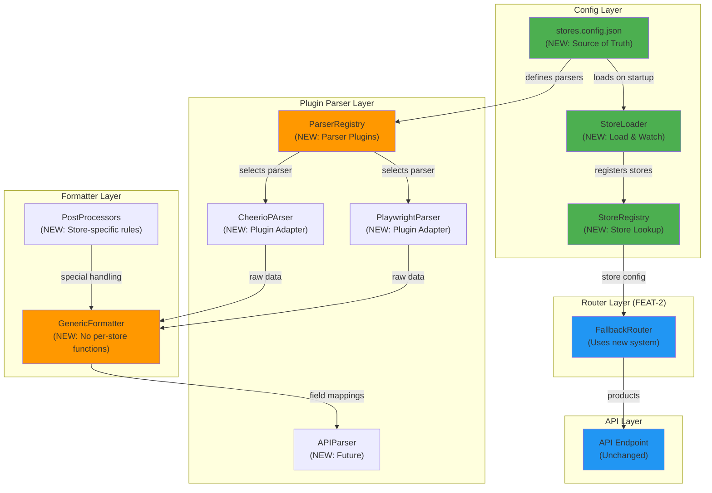

# FEAT-3: Configuration-Driven Architecture - Implementation Plan

## Goal

Transform the scraper from hardcoded logic to configuration-driven architecture, enabling true scalability. This feature implements a plugin-based parser system and generic field-mapping formatter, allowing new stores to be added via JSON configuration only—no code changes required. Reduces store onboarding from 4-5 hours to 30 minutes. This is the **critical scalability enabler** that makes the entire solution viable for 50+ stores. Configuration changes support hot-reload, eliminating restart requirements.

---

## Requirements

### Functional Requirements
- **JSON Configuration**: `stores.config.json` as single source of truth for all store definitions
- **Plugin Parsers**: Pluggable parser system (Cheerio, Playwright, API) selected via config
- **Generic Formatter**: Field-mapping based formatter eliminating per-store formatter functions
- **Store Loader**: Dynamic store registration from configuration
- **Hot-Reload**: Configuration changes applied without application restart
- **All 6 Stores**: Migrate existing stores to configuration-driven (zero loss of functionality)
- **Add Store Demo**: Add 7th store in 30 minutes as proof of concept
- **Validation**: Strict schema validation on config load
- **Performance**: <1 second overhead from config system

### Non-Functional Requirements
- **Zero Breaking Changes**: Existing API endpoint unchanged
- **Backward Compatible**: Keep stores.enum.ts as fallback
- **Test Coverage**: >85% for parser system and formatter
- **Scalability**: Support 50+ stores without code changes
- **Memory**: Configuration loaded once at startup
- **Documentation**: Clear guide for adding new stores

### Implementation Specifics
- Configuration schema defined with Zod or similar
- Parser registry pattern for selecting parsers
- Field mapping supports: CSS selectors, XPath, regex, text extraction
- Generic formatter applies mappings, handles null/empty values
- Store loader watches config file for changes (hot-reload)
- Graceful degradation if config is invalid (use backup enum)

---

## Technical Considerations

### System Architecture Overview



### Technology Stack Selection

| Component | Technology | Rationale |
|-----------|-----------|-----------|
| **Configuration** | JSON + Zod | Type-safe, clear, version-controllable |
| **Parser System** | Plugin pattern | Extensible, testable, adds new parsers easily |
| **Field Mapping** | CSS selectors | Already know from Cheerio, covers 95% of cases |
| **Generic Formatter** | Data mapper | Eliminates code duplication by 80%+ |
| **Hot-Reload** | Node.js fs.watch | Simple, no extra dependencies |
| **Validation** | Zod schema | Runtime type-safety |

### Integration Points

**Configuration Source**: `src/config/stores.config.json`
- Defines all 6+ stores
- Specifies parser, selectors, formatters per store
- Loaded on app startup, watched for changes

**Parser Registry**: `src/lib/parsers/parser-registry.ts`
- Manages all available parsers
- Returns correct parser for store config
- Extensible for future parsers (new sources, APIs, etc.)

**Generic Formatter**: `src/lib/formatters/generic-formatter.ts`
- Takes raw data + field mappings
- Applies selector-based extraction
- Handles null/empty values
- Applies post-processing if configured

**Store Loader**: `src/lib/store-loader.ts`
- Loads config from JSON
- Validates against Zod schema
- Registers stores in registry
- Watches for config changes

**Router Integration**: FallbackRouter (FEAT-2) updated to use new system
- Instead of: `selectAdapter('cetrogar')` enum lookup
- Now: `storeRegistry.get('cetrogar').parser` config lookup

### Deployment Architecture

```
Configuration File:
├── src/config/stores.config.json
├── Committed to git
├── Can be changed without code deploy (with hot-reload)
└── Single source of truth for all store definitions

Parser Plugins:
├── src/lib/parsers/
│   ├── parser.interface.ts (interface)
│   ├── cheerio-parser.ts (implementation)
│   ├── playwright-parser.ts (implementation)
│   └── api-parser.ts (future)
└── Each parser isolated, testable

Formatter System:
├── src/lib/formatters/generic-formatter.ts
├── src/lib/formatters/post-processors.ts
└── No per-store formatter functions

Store Registry:
├── In-memory after load
├── Rebuilt on config change
├── Provides lookup: store name → config
└── Used by all consuming code
```

### Scalability Considerations

**Adding New Store (30 minutes)**:
1. Add JSON entry to stores.config.json (5 min)
2. Define CSS selectors (10 min, inspect site)
3. Set formatter and post-processor if needed (5 min)
4. Test with real scrape (10 min)
5. Deploy config file (0 min if hot-reload)
**Total: 30 minutes, NO CODE CHANGES**

**Compare to old approach** (4-5 hours):
1. Add enum entry (5 min)
2. Write formatProductNewStore() function (30 min, boilerplate)
3. Write encodeNewStoreQuery() function (30 min, custom logic)
4. Update router switch statement (10 min)
5. Write unit tests (60 min)
6. Integration test (30 min)
7. Code review (30 min)
8. Commit and deploy code (10 min)
**Total: 4-5 hours, CODE REVIEW CYCLE**

**Throughput**:
- Static HTML stores: <100ms (Cheerio)
- JS stores: 2-5s (Playwright)
- Already scaled via adapters (no regression)

**Memory**:
- Config: ~10KB per store
- 50 stores: ~500KB (negligible)
- No impact to Cheerio/Playwright memory usage

---

## Database Schema Design

**Not applicable for FEAT-3** - Purely configuration-driven, no database changes.

**Existing cache** still used as fallback (unchanged).

---

## API Design

### Store Configuration Schema

**File**: `src/config/stores.config.json`

```json
{
  "version": "1.0",
  "stores": {
    "cetrogar": {
      "enabled": true,
      "name": "Cetrogar",
      "type": "static-html",
      "baseUrl": "https://www.cetrogar.com.ar",
      "searchPath": "/search?q={query}",
      "parser": "cheerio",
      "selectors": {
        "products": ".product-item",
        "name": ".product-name",
        "price": ".product-price",
        "url": "a.product-link",
        "image": "img.product-image"
      },
      "formatter": "genericFormatter",
      "postProcessor": null,
      "pagination": {
        "type": "query-param",
        "key": "page",
        "startIndex": 1
      }
    },
    "musimundo": {
      "enabled": true,
      "name": "Musimundo",
      "type": "spa-javascript",
      "baseUrl": "https://www.musimundo.com.ar",
      "searchPath": "/search?q={query}",
      "parser": "playwright",
      "selectors": {
        "products": "[data-test='product-card']",
        "name": "[data-test='product-name']",
        "price": "[data-test='product-price']",
        "url": "a[data-test='product-link']",
        "image": "[data-test='product-image']"
      },
      "formatter": "genericFormatter",
      "postProcessor": "musimundoPostProcessor",
      "timeout": 5000,
      "waitForSelector": "[data-test='product-card']"
    },
    "newstore7": {
      "enabled": true,
      "name": "New Store #7",
      "type": "static-html",
      "baseUrl": "https://www.newstore.com",
      "searchPath": "/buscar?q={query}",
      "parser": "cheerio",
      "selectors": {
        "products": ".item",
        "name": ".titulo",
        "price": ".precio",
        "url": "a.enlace",
        "image": "img.foto"
      },
      "formatter": "genericFormatter",
      "postProcessor": null
    }
  }
}
```

### Parser Plugin Interface

```typescript
// src/lib/parsers/parser.interface.ts

export interface IParser {
  name: string;
  canHandle(storeType: string): boolean;
  parse(url: string, config: StoreConfig): Promise<RawData[]>;
}

export type RawData = Record<string, any>;

export interface StoreConfig {
  enabled: boolean;
  name: string;
  type: 'static-html' | 'spa-javascript' | 'api';
  baseUrl: string;
  searchPath: string;
  parser: 'cheerio' | 'playwright' | 'api';
  selectors: Record<string, string>;
  formatter: string;
  postProcessor?: string;
  timeout?: number;
  waitForSelector?: string;
}

// Implementations

export class CheerioPArser implements IParser {
  name = 'cheerio';
  
  canHandle(storeType: string): boolean {
    return storeType === 'static-html';
  }
  
  async parse(url: string, config: StoreConfig): Promise<RawData[]> {
    // Use existing Cheerio logic
    // Load HTML, select products, extract fields
  }
}

export class PlaywrightParser implements IParser {
  name = 'playwright';
  
  canHandle(storeType: string): boolean {
    return storeType === 'spa-javascript';
  }
  
  async parse(url: string, config: StoreConfig): Promise<RawData[]> {
    // Use FEAT-1 Playwright logic
    // Launch browser, render JS, select products, extract fields
  }
}

export class APIParser implements IParser {
  name = 'api';
  
  canHandle(storeType: string): boolean {
    return storeType === 'api';
  }
  
  async parse(url: string, config: StoreConfig): Promise<RawData[]> {
    // Direct API call, parse JSON
  }
}
```

### Generic Formatter API

```typescript
// src/lib/formatters/generic-formatter.ts

export interface FieldMapping {
  [fieldName: string]: string; // CSS selector or config path
}

export interface FormatterConfig {
  fieldMappings: FieldMapping;
  postProcess?: (product: Product) => Product;
}

export function genericFormatter(
  rawData: RawData[],
  fieldMappings: FieldMapping
): Product[] {
  return rawData.map(raw => {
    const product: Product = {};
    
    Object.entries(fieldMappings).forEach(([field, selector]) => {
      // Extract field from raw data using selector
      product[field] = extractField(raw, selector);
    });
    
    // Handle null/empty values
    Object.keys(product).forEach(key => {
      if (product[key] === null || product[key] === undefined) {
        product[key] = '';
      }
    });
    
    return product;
  });
}

// Post-processors for store-specific rules
export const postProcessors: Record<string, PostProcessor> = {
  musimundoPostProcessor: (product: Product) => {
    // Musimundo-specific cleanup
    product.price = product.price.replace('$', '').trim();
    return product;
  },
  
  carrefourPostProcessor: (product: Product) => {
    // Carrefour-specific cleanup
    product.url = new URL(product.url, 'https://www.carrefour.com.ar').href;
    return product;
  },
};
```

### Store Registry API

```typescript
// src/lib/store-registry.ts

export class StoreRegistry {
  private stores: Map<string, StoreConfig> = new Map();
  private parsers: Map<string, IParser> = new Map();
  
  constructor(parsers: IParser[]) {
    parsers.forEach(parser => {
      this.parsers.set(parser.name, parser);
    });
  }
  
  async loadStores(configPath: string): Promise<void> {
    const config = await fs.readFile(configPath, 'utf-8');
    const parsed = JSON.parse(config);
    
    // Validate with Zod schema
    validateStoreConfig(parsed);
    
    // Clear and reload
    this.stores.clear();
    
    Object.entries(parsed.stores).forEach(([key, store]) => {
      if (store.enabled) {
        this.stores.set(key, store);
      }
    });
  }
  
  getStore(name: string): StoreConfig {
    const store = this.stores.get(name);
    if (!store) throw new Error(`Store ${name} not found`);
    return store;
  }
  
  getParser(config: StoreConfig): IParser {
    const parser = this.parsers.get(config.parser);
    if (!parser) throw new Error(`Parser ${config.parser} not found`);
    return parser;
  }
  
  getAllStores(): StoreConfig[] {
    return Array.from(this.stores.values());
  }
}
```

### Store Loader API

```typescript
// src/lib/store-loader.ts

export class StoreLoader {
  constructor(
    private registry: StoreRegistry,
    private configPath: string
  ) {}
  
  async initialize(): Promise<void> {
    // Load config on startup
    await this.registry.loadStores(this.configPath);
    logger.info('Stores loaded', { count: this.registry.getAllStores().length });
  }
  
  async watch(): Promise<void> {
    // Watch for config changes
    fs.watch(this.configPath, async (eventType, filename) => {
      if (eventType === 'change') {
        try {
          await this.registry.loadStores(this.configPath);
          logger.info('Stores reloaded from config change');
        } catch (error) {
          logger.error('Failed to reload stores', { error });
        }
      }
    });
  }
}
```

---

## Frontend Architecture

**Not applicable for FEAT-3** - Configuration is backend-only.

**Existing API** unchanged - Frontend continues to work identically.

---

## Security & Performance

### Data Validation & Sanitization

**Configuration Validation**:
```typescript
// Zod schema
const StoreConfigSchema = z.object({
  enabled: z.boolean(),
  name: z.string().min(1).max(100),
  type: z.enum(['static-html', 'spa-javascript', 'api']),
  baseUrl: z.string().url(),
  searchPath: z.string(),
  parser: z.enum(['cheerio', 'playwright', 'api']),
  selectors: z.record(z.string()),
  formatter: z.string(),
  postProcessor: z.string().optional(),
  timeout: z.number().optional(),
  waitForSelector: z.string().optional(),
});

const configSchema = z.object({
  version: z.string(),
  stores: z.record(StoreConfigSchema),
});
```

**Input Validation**:
```typescript
function validateStoreConfig(config: any) {
  try {
    return configSchema.parse(config);
  } catch (error) {
    throw new Error(`Invalid store configuration: ${error}`);
  }
}
```

### Performance Optimization Strategies

**Configuration Loading**:
- Loaded once on app startup (no per-request overhead)
- Cached in memory
- Hot-reload updates cache without restart

**Field Mapping**:
- Pre-compiled selectors (if using Cheerio internally)
- No regex compilation per request
- Direct property mapping

**Memory**:
- Config: ~10KB per store
- 50 stores: ~500KB total
- Negligible overhead

---

## Implementation Tasks

### Task Group 1: Configuration System (US-301)

**Task 1.1**: Create `src/config/stores.config.json`
- [ ] Copy existing store definitions from code
- [ ] Define all 6 stores in configuration
- [ ] For each store:
  - [ ] Set type (static-html or spa-javascript)
  - [ ] Set baseUrl
  - [ ] Define CSS selectors for products, name, price, url, image
  - [ ] Specify parser (cheerio or playwright)
  - [ ] Specify formatter (genericFormatter)
  - [ ] Add post-processor if needed (musimundo, carrefour)

**Task 1.2**: Create Zod schema
- [ ] Create `src/config/store-config.schema.ts`
- [ ] Define StoreConfig interface
- [ ] Define validation rules
- [ ] Export validator function

**Task 1.3**: Integration with app startup
- [ ] Load config on app initialization
- [ ] Catch validation errors
- [ ] Fallback to stores.enum.ts if config invalid
- [ ] Log loaded stores count

### Task Group 2: Parser Plugin System (US-302)

**Task 2.1**: Create parser interfaces
- [ ] Create `src/lib/parsers/parser.interface.ts`
- [ ] Define `IParser` interface
- [ ] Define `RawData` type
- [ ] Export types for implementations

**Task 2.2**: Implement Cheerio parser
- [ ] Create `src/lib/parsers/cheerio-parser.ts`
- [ ] Implement `canHandle()` for static-html
- [ ] Implement `parse()` using existing Cheerio logic
- [ ] Extract products using config selectors
- [ ] Return array of RawData

**Task 2.3**: Implement Playwright parser
- [ ] Create `src/lib/parsers/playwright-parser.ts`
- [ ] Implement `canHandle()` for spa-javascript
- [ ] Implement `parse()` using FEAT-1 PlaywrightAdapter
- [ ] Wait for selector if configured
- [ ] Extract products using config selectors
- [ ] Return array of RawData

**Task 2.4**: Create parser registry
- [ ] Create `src/lib/parsers/parser-registry.ts`
- [ ] Implement `ParserRegistry` class
- [ ] Register all parsers
- [ ] Implement `selectParser(storeType)` method
- [ ] Handle unknown parser gracefully

### Task Group 3: Generic Formatter (US-303)

**Task 3.1**: Create field extraction utilities
- [ ] Create `src/lib/formatters/field-extractor.ts`
- [ ] Implement `extractField(rawData, selector)` function
- [ ] Support CSS selector paths
- [ ] Handle null/undefined values
- [ ] Handle type coercion

**Task 3.2**: Implement generic formatter
- [ ] Create `src/lib/formatters/generic-formatter.ts`
- [ ] Implement `formatProducts(rawData, fieldMappings)` function
- [ ] Apply field mappings to each product
- [ ] Clean up empty/null values
- [ ] Type result as Product[]

**Task 3.3**: Create post-processors
- [ ] Create `src/lib/formatters/post-processors.ts`
- [ ] Implement `musimundoPostProcessor` (price cleanup)
- [ ] Implement `carrefourPostProcessor` (URL normalization)
- [ ] Export processor registry
- [ ] Allow easy addition of new post-processors

### Task Group 4: Store Management (US-304)

**Task 4.1**: Create store registry
- [ ] Create `src/lib/store-registry.ts`
- [ ] Implement `StoreRegistry` class
- [ ] Load stores from config
- [ ] Validate against schema
- [ ] Provide `getStore(name)` method
- [ ] Provide `getAllStores()` method

**Task 4.2**: Create store loader
- [ ] Create `src/lib/store-loader.ts`
- [ ] Implement `StoreLoader` class
- [ ] Load config on app start
- [ ] Watch for config changes
- [ ] Update registry on change
- [ ] Handle errors gracefully

**Task 4.3**: App initialization
- [ ] Update `src/app.ts` or startup code
- [ ] Initialize StoreLoader
- [ ] Start file watcher
- [ ] Verify all stores loaded
- [ ] Log store count and names

### Task Group 5: Router Integration

**Task 5.1**: Update FallbackRouter (FEAT-2)
- [ ] Replace enum lookups with registry
- [ ] Use `storeRegistry.getStore(name)` instead of enum
- [ ] Use `storeRegistry.getParser(config)` for adapter selection
- [ ] No logic changes, just data source change

**Task 5.2**: Update API endpoint
- [ ] `src/app/api/scrape/route.ts` uses registry
- [ ] Validate store exists in registry
- [ ] Pass config to router
- [ ] No response format changes

### Task Group 6: Migration (EN-301)

**Task 6.1**: Migrate Cetrogar
- [ ] Copy current scraper logic to config
- [ ] Define all selectors
- [ ] Test with new system
- [ ] Verify same products returned
- [ ] Commit and merge

**Task 6.2**: Migrate Fravega, Naldo, Carrefour
- [ ] Repeat for each store
- [ ] Test each migration
- [ ] Verify success rate unchanged

**Task 6.3**: Migrate Musimundo
- [ ] Add post-processor
- [ ] Test Playwright parser
- [ ] Verify JS-rendered content captured

**Task 6.4**: Migrate MercadoLibre
- [ ] Test with Playwright
- [ ] Any special handling needed
- [ ] Verify success rate

**Task 6.5**: Validation
- [ ] All 6 stores working with new system
- [ ] Success rate maintained (>85%)
- [ ] No functionality lost
- [ ] Ready for prod

### Task Group 7: Demo - Add 7th Store (US-304)

**Task 7.1**: Choose 7th store
- [ ] Pick any electronics store (e.g., Garbarino, Jumbo)
- [ ] Similar to existing stores (verify it's scrapable)
- [ ] Test website accessibility

**Task 7.2**: Add to config (5 minutes)
- [ ] Add entry to stores.config.json
- [ ] Define baseUrl and searchPath
- [ ] Inspect website for selectors

**Task 7.3**: Define selectors (10 minutes)
- [ ] Use browser DevTools to inspect
- [ ] Find product container selector
- [ ] Find name, price, url, image selectors
- [ ] Note any CSS classes or data attributes

**Task 7.4**: Configure formatter (5 minutes)
- [ ] Set formatter to genericFormatter
- [ ] Add post-processor if needed
- [ ] Set parser (cheerio or playwright)

**Task 7.5**: Test and validate (10 minutes)
- [ ] Reload app (or wait for hot-reload)
- [ ] Make test request: `POST /api/scrape { store: "newstore7", query: "tv" }`
- [ ] Verify products returned
- [ ] Verify success rate >80%

**Task 7.6**: Document (0 minutes)
- [ ] Take screenshot of config
- [ ] Note that this took 30 minutes
- [ ] No code changes required
- [ ] Proof of scalability achieved

---

## Testing Strategy

### Unit Tests

#### Parser Tests
```typescript
describe('CheerioPArser', () => {
  test('should extract products using selectors', async () => {
    const parser = new CheerioPArser();
    const html = '<div class="product"><span class="name">Product</span></div>';
    const config: StoreConfig = {
      selectors: {
        products: '.product',
        name: '.name',
      },
      // ... other config
    };
    
    const result = await parser.parse(html, config);
    expect(result[0].name).toBe('Product');
  });
});

describe('PlaywrightParser', () => {
  test('should wait for selector before extracting', async () => {
    // Test that waitForSelector is respected
  });
});
```

#### Formatter Tests
```typescript
describe('GenericFormatter', () => {
  test('should apply field mappings', () => {
    const raw = [
      { product: 'TV', priceTag: '1000', link: '/tv' }
    ];
    const mappings = {
      name: 'product',
      price: 'priceTag',
      url: 'link'
    };
    
    const result = genericFormatter(raw, mappings);
    expect(result[0].name).toBe('TV');
    expect(result[0].price).toBe('1000');
  });

  test('should handle null values', () => {
    const raw = [{ product: 'TV', priceTag: null }];
    const result = genericFormatter(raw, {
      name: 'product',
      price: 'priceTag'
    });
    expect(result[0].price).toBe('');
  });
});
```

#### Registry & Loader Tests
```typescript
describe('StoreRegistry', () => {
  test('should load stores from config', async () => {
    const registry = new StoreRegistry([...parsers]);
    await registry.loadStores('src/config/stores.config.json');
    
    expect(registry.getAllStores().length).toBeGreaterThan(0);
  });

  test('should get store by name', async () => {
    const store = registry.getStore('cetrogar');
    expect(store.name).toBe('Cetrogar');
  });

  test('should select correct parser', async () => {
    const store = registry.getStore('cetrogar');
    const parser = registry.getParser(store);
    expect(parser.name).toBe('cheerio');
  });
});

describe('StoreLoader', () => {
  test('should watch for config changes', async (done) => {
    const loader = new StoreLoader(registry, configPath);
    await loader.initialize();
    
    // Modify config file
    // Wait for reload
    // Verify stores updated
    
    done();
  });
});
```

### Integration Tests

```typescript
describe('FEAT-3 Integration: Config-Driven System', () => {
  test('should migrate all 6 stores successfully', async () => {
    const registry = new StoreRegistry([...parsers]);
    await registry.loadStores('src/config/stores.config.json');
    
    const stores = registry.getAllStores();
    expect(stores.length).toBe(6);
    
    // Test each store
    for (const store of stores) {
      const parser = registry.getParser(store);
      // Scrape and verify
    }
  });

  test('should add 7th store and scrape successfully', async () => {
    // Add new store to config
    // Reload registry
    // Test scraping 7th store
    // Verify success
  });

  test('should hot-reload on config change', async () => {
    // Initial load
    let stores = registry.getAllStores();
    const initialCount = stores.length;
    
    // Modify config file
    // Wait for hot-reload
    stores = registry.getAllStores();
    expect(stores.length).toBeGreaterThan(initialCount);
  });
});
```

### E2E Tests

```typescript
describe('FEAT-3 E2E: Real Store Scraping with Config', () => {
  test('should scrape all 6 stores with new system', async () => {
    const stores = ['cetrogar', 'fravega', 'naldo', 'carrefour', 'musimundo', 'mercadolibre'];
    
    for (const storeName of stores) {
      const response = await fetch('/api/scrape', {
        method: 'POST',
        body: JSON.stringify({ store: storeName, query: 'tv' })
      });
      
      const result = await response.json();
      expect(result.length).toBeGreaterThan(0);
      expect(result[0].name).toBeTruthy();
      expect(result[0].price).toBeTruthy();
    }
  });

  test('should add 7th store in 30 minutes', async () => {
    // Time test execution
    const startTime = Date.now();
    
    // 1. Add to config (5 min)
    // 2. Define selectors (10 min)
    // 3. Test scrape (10 min)
    // 4. Verify success (5 min)
    
    const duration = Date.now() - startTime;
    expect(duration).toBeLessThan(30 * 60 * 1000); // 30 minutes
  });
});
```

### Test Coverage Target

| Module | Target | Priority |
|--------|--------|----------|
| `parser-registry.ts` | >90% | HIGH |
| `cheerio-parser.ts` | >85% | HIGH |
| `playwright-parser.ts` | >85% | HIGH |
| `generic-formatter.ts` | >95% | HIGH |
| `store-registry.ts` | >85% | HIGH |
| `store-loader.ts` | >80% | HIGH |
| Integration tests | All 6 stores | HIGH |
| Migration tests | E2E per store | HIGH |
| Demo: 7th store | Success | HIGH |

---

## Definition of Done

- [ ] Configuration schema defined with Zod
- [ ] `stores.config.json` created with all 6 stores
- [ ] Parser interface defined
- [ ] Cheerio parser implemented as plugin
- [ ] Playwright parser implemented as plugin
- [ ] Generic formatter implemented
- [ ] Post-processors for store-specific logic
- [ ] Store registry implemented
- [ ] Store loader with hot-reload
- [ ] All 6 stores migrated to configuration
- [ ] All 6 stores tested (success rate >85% each)
- [ ] Demo: 7th store added in 30 minutes
- [ ] Unit tests passing (>85% coverage)
- [ ] Integration tests passing
- [ ] E2E tests passing
- [ ] No functionality lost from old system
- [ ] Documentation for adding new stores
- [ ] Pull request created and approved

---

## Risks & Mitigations

| Risk | Probability | Impact | Mitigation |
|------|------------|--------|-----------|
| **Migration regression** | Medium | High | Test each store before migration |
| **Config validation fails** | Low | High | Strict schema, test with Zod |
| **Hot-reload breaks store** | Low | High | Graceful error handling, fallback |
| **Performance regression** | Low | Medium | Benchmark before/after |
| **Selector changes break** | Medium | Medium | Document selectors, test often |

---

## Acceptance Criteria

### Story: US-301 (Configuration System)
- [ ] `stores.config.json` created
- [ ] All 6 stores defined in config
- [ ] Zod schema validates config
- [ ] Config loaded on app startup
- [ ] Invalid config handled gracefully
- [ ] Config file watched for changes
- [ ] Unit tests passing

### Story: US-302 (Plugin Parser System)
- [ ] Parser interface defined
- [ ] Cheerio parser implemented
- [ ] Playwright parser implemented
- [ ] Parser registry implemented
- [ ] Parsers return correct RawData
- [ ] Unit tests passing (>85%)

### Story: US-303 (Generic Formatter)
- [ ] Field extraction working
- [ ] Field mappings applied correctly
- [ ] Null/empty values handled
- [ ] Post-processors integrated
- [ ] Unit tests passing (>95%)

### Story: US-304 (Store Loader & Hot-Reload)
- [ ] Store registry implemented
- [ ] Store loader implemented
- [ ] Hot-reload working
- [ ] No breaking changes
- [ ] Backward compatible
- [ ] Unit tests passing

### Enabler: EN-301 (Migrate 6 Stores)
- [ ] Cetrogar migrated and tested (>85% success)
- [ ] Fravega migrated and tested (>85% success)
- [ ] Naldo migrated and tested (>85% success)
- [ ] Carrefour migrated and tested (>85% success)
- [ ] Musimundo migrated and tested (>85% success)
- [ ] MercadoLibre migrated and tested (>85% success)
- [ ] Zero functionality loss
- [ ] All 6 stores using new system
- [ ] Demo: Add 7th store in <30 minutes
- [ ] Integration tests passing

---

## Timeline

| Task | Duration | Days |
|------|----------|------|
| **US-301**: Config system | 3 hours | Day 6 |
| **US-302**: Parser plugins | 5 hours | Day 6-7 |
| **US-303**: Generic formatter | 4 hours | Day 7 |
| **US-304**: Store loader | 3 hours | Day 7 |
| **EN-301**: Migrate 6 stores | 7 hours | Day 8-9 |
| **Demo: 7th store** | 1 hour | Day 9 |
| **Testing & review** | 3 hours | Day 10 |
| **Total** | 26 hours | Days 6-10 |

---

## Dependencies & Blockers

**Blocks**: v2.0.0 Release
- This feature unlocks true scalability
- Demonstrates 30-minute store onboarding
- Enables FEAT-4 (browser pooling)

**Depends On**: FEAT-2 (Fallback Router)
- Uses router for actual scraping
- Updates router to use new configuration system
- **Blocker**: FEAT-2 must be complete

**Needs From**: FEAT-1 (Playwright)
- PlaywrightParser uses FEAT-1 PlaywrightAdapter
- ErrorCategorizer used by router
- **Blocker**: FEAT-1 must be complete

---

## Success Metrics

| Metric | Target | Validation |
|--------|--------|-----------|
| **6 stores migrated** | 100% | All in config |
| **Success rates maintained** | >85% each | Per-store testing |
| **Functionality preserved** | 100% | Same results as before |
| **Test coverage** | >85% | Code coverage tools |
| **Add 7th store** | <30 min | Timed demo |
| **Hot-reload works** | 100% | Config change test |
| **Zero breaking changes** | 100% | API unchanged |

---

**Created**: 2025-01-10  
**Feature**: FEAT-3  
**Stories**: US-301, US-302, US-303, US-304, EN-301  
**Status**: Ready for Implementation (after FEAT-2 complete)  
**Total Story Points**: 21  
**Critical Feature**: YES - Scalability Enabler
