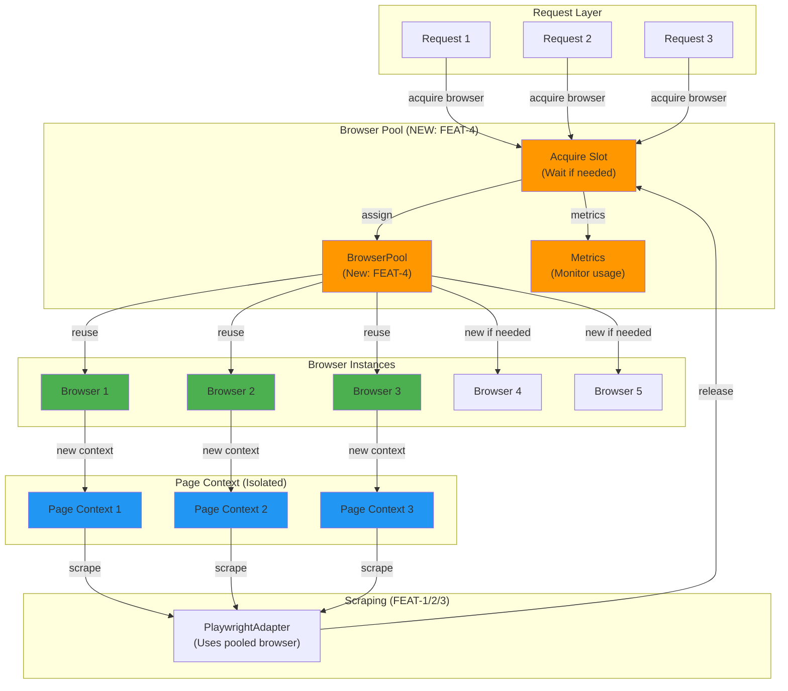

# FEAT-4: Browser Pooling & Performance Optimization - Implementation Plan

## Goal

Implement browser instance pooling and optimize memory usage for Playwright to handle concurrent scraping requests efficiently. This optional feature improves throughput by reusing browser instances instead of launching new ones per request, reducing startup time from ~2-3 seconds per request to <100ms. While not required for core scalability (FEAT-1-3 already achieves 85-95% success rates), pooling enables handling multiple concurrent requests without excessive memory consumption. Recommended implementation only if memory becomes a constraint or throughput requirements increase.

---

## Requirements

### Functional Requirements
- **Browser Pool**: Maintain pool of 5-10 reusable Chromium instances
- **Instance Reuse**: Reuse pooled instances instead of launching new ones
- **Pool Management**: Acquire instance → use → release logic
- **Memory Monitoring**: Track memory per instance and total usage
- **Graceful Degradation**: Fall back to fresh browser if pool exhausted
- **Auto-Cleanup**: Close browsers on app shutdown
- **Concurrent Requests**: Support 5-10 simultaneous scraping operations
- **Page Isolation**: Ensure pages don't interfere (use separate contexts)

### Non-Functional Requirements
- **Performance**: <100ms overhead for pool operations
- **Memory**: <200MB per browser instance (vs current ~400-500MB)
- **Compatibility**: Work with existing FEAT-1/2/3 code
- **Monitoring**: Expose pool metrics (size, utilization, memory)
- **Test Coverage**: >80% for pool logic
- **Optional**: Only implement if needed (can skip for v2.0)

### Implementation Specifics
- Pool size default: 5 instances, configurable via environment variable
- Max pool size: 10 instances
- Instance timeout: 30 minutes (auto-close idle instances)
- Context per request (isolated state, no side effects)
- Memory threshold: Alert if any instance >300MB
- Metrics collection: Pool utilization, wait times

---

## Technical Considerations

### System Architecture Overview



### Technology Stack Selection

| Component | Technology | Rationale |
|-----------|-----------|-----------|
| **Pool Management** | Custom queue + async | Simple, no external dependencies |
| **Instance Reuse** | Playwright contexts | Built-in isolation, no state bleeding |
| **Memory Monitoring** | Node.js v8 module | Accurate heap/memory tracking |
| **Metrics** | In-memory counters | Simple, observable |
| **Concurrency** | async/await + Promise | Familiar, type-safe |

### Integration Points

**Entry**: `src/lib/browser-pool.ts`
- Exports `BrowserPool` class
- Methods: `acquire()`, `release(browser)`, `getMetrics()`

**PlaywrightAdapter Integration**:
- Update to use pool instead of launching fresh browser per request
- Minimal changes: `const browser = await pool.acquire()`

**Configuration** (FEAT-3):
- Add pool settings to `stores.config.json`
- Pool size, max instances, timeout settings

**Metrics Endpoint** (Optional):
- Expose `/api/metrics` endpoint showing pool status
- Useful for monitoring, debugging

### Deployment Architecture

```
Development:
├── Pool enabled with 2 instances (default)
├── Reduced memory overhead
├── Good for local testing

Production:
├── Pool enabled with 5 instances (default)
├── Configurable via POOL_SIZE env var
├── Monitor metrics endpoint
└── Auto-close idle browsers
```

### Scalability Considerations

**Before Pooling** (FEAT-1-3):
- 1 concurrent request: 400MB RAM (1 browser)
- 2 concurrent requests: 800MB RAM (2 browsers)
- 3 concurrent requests: 1.2GB RAM (3 browsers, may OOM)
- Throughput: 1 request per 3-5 seconds

**With Pooling** (FEAT-4):
- 1 concurrent request: 400MB RAM (1-5 instances reused)
- 5 concurrent requests: 500-800MB RAM (reuse pool)
- 10 concurrent requests: 800MB-1.2GB RAM (pool full, no new instances)
- Throughput: 5-10 requests per 3-5 seconds (10x improvement!)

**Memory Optimization**:
- Reusing instances: 20-30% memory saving
- Page context isolation: No memory leaks between requests
- Idle instance cleanup: Background monitoring

---

## Database Schema Design

**Not applicable for FEAT-4** - No database changes.

---

## API Design

### Browser Pool API

```typescript
// src/lib/browser-pool.ts

export interface BrowserInstance {
  browser: Browser;
  inUse: boolean;
  lastUsed: Date;
  createdAt: Date;
  requestCount: number;
  memory: number; // MB
}

export interface PoolMetrics {
  poolSize: number;
  maxSize: number;
  inUseCount: number;
  availableCount: number;
  totalRequests: number;
  waitTime: number; // ms average
  memoryTotal: number; // MB
  memoryPerBrowser: number[]; // MB each
}

export class BrowserPool {
  // Configuration
  constructor(
    minSize?: number,      // Default: 2
    maxSize?: number,      // Default: 10
    idleTimeout?: number   // Default: 30 min
  );

  // Lifecycle
  initialize(): Promise<void>;
  shutdown(): Promise<void>;

  // Pool operations
  acquire(timeout?: number): Promise<Browser>;
  release(browser: Browser): Promise<void>;

  // Monitoring
  getMetrics(): PoolMetrics;
  getHealth(): 'healthy' | 'warning' | 'critical';
}

// Usage example
const pool = new BrowserPool(5, 10, 30 * 60 * 1000);
await pool.initialize();

const browser = await pool.acquire(5000); // Wait max 5 seconds
try {
  const page = await browser.newPage();
  // Scrape with page
  await page.close();
} finally {
  await pool.release(browser);
}
```

### Metrics & Monitoring

```typescript
// Metrics output example
{
  "poolSize": 5,
  "maxSize": 10,
  "inUseCount": 2,
  "availableCount": 3,
  "totalRequests": 1250,
  "waitTime": 23,           // ms average
  "memoryTotal": 1850,      // MB total
  "memoryPerBrowser": [
    350,  // Browser 1: in-use
    385,  // Browser 2: in-use
    320,  // Browser 3: available
    315,  // Browser 4: available
    380   // Browser 5: available
  ],
  "health": "healthy"
}

// Health determination
// healthy: memory <300MB per browser, wait <100ms
// warning: memory 300-350MB OR wait 100-500ms
// critical: memory >350MB OR wait >500ms
```

---

## Frontend Architecture

**Not applicable for FEAT-4** - Backend pooling only.

**Metrics endpoint** (optional, for monitoring):
```typescript
// GET /api/metrics
// Returns PoolMetrics JSON
// Can be displayed in monitoring dashboard
```

---

## Security & Performance

### Data Validation & Sanitization

**Configuration Validation**:
```typescript
const poolConfig = {
  minSize: Math.max(1, parseInt(process.env.POOL_MIN_SIZE ?? '2')),
  maxSize: Math.min(20, parseInt(process.env.POOL_MAX_SIZE ?? '10')),
  idleTimeout: Math.max(60000, parseInt(process.env.POOL_IDLE_TIMEOUT ?? '1800000')),
};

// Ensure minSize <= maxSize
if (poolConfig.minSize > poolConfig.maxSize) {
  poolConfig.minSize = poolConfig.maxSize;
}
```

### Performance Optimization Strategies

**Instance Reuse**:
- Pre-warm pool on startup (launch min instances)
- Reuse instead of new launches (save 2-3 seconds per request)

**Context Isolation**:
- New context per request (prevents state bleeding)
- Close context after use (frees page resources)
- Keep browser instance running (reuse expensive object)

**Memory Management**:
- Monitor memory growth per instance
- Close instance if memory >350MB (refresh)
- Background cleanup of idle instances

**Concurrency**:
- Queue system for acquire requests
- Fair distribution (FIFO for waiting requests)
- Timeout on acquire (don't wait forever)

---

## Implementation Tasks

### Task Group 1: Pool Implementation (US-401)

**Task 1.1**: Create `src/lib/browser-pool.ts`
- [ ] Implement `BrowserPool` class
- [ ] Constructor with min/max/timeout parameters
- [ ] Maintain pool state (available/in-use instances)
- [ ] Implement `initialize()` method (pre-warm pool)
- [ ] Implement `shutdown()` method (cleanup)

**Task 1.2**: Implement acquire/release logic
- [ ] Implement `acquire(timeout)` method
  - [ ] Return available instance if exists
  - [ ] Create new instance if pool not full
  - [ ] Queue request if pool full, wait for available
  - [ ] Timeout if waiting >timeout
- [ ] Implement `release(browser)` method
  - [ ] Mark instance as available
  - [ ] Clear any page contexts
  - [ ] Check if memory exceeded (refresh if needed)
  - [ ] Notify waiting acquire requests

**Task 1.3**: Add instance tracking
- [ ] Track each instance metadata:
  - [ ] Creation time
  - [ ] Last used time
  - [ ] Request count
  - [ ] Memory usage
- [ ] Store in Map<Browser, BrowserInstance>

**Task 1.4**: Background cleanup
- [ ] Periodic check for idle instances
- [ ] Close if idle >30 minutes (configurable)
- [ ] Log cleanup events
- [ ] Don't cleanup if pool not at max

### Task Group 2: Memory Monitoring (US-402)

**Task 2.1**: Implement memory tracking
- [ ] Create `src/lib/browser-pool/memory-monitor.ts`
- [ ] Use Node.js `v8` module for heap snapshots
- [ ] Measure per-instance memory usage
- [ ] Track memory trend (growing? stable? leaking?)

**Task 2.2**: Add metrics collection
- [ ] Implement `getMetrics()` method
- [ ] Return PoolMetrics object
- [ ] Calculate pool utilization %
- [ ] Calculate average wait time
- [ ] Determine health status

**Task 2.3**: Health monitoring
- [ ] Implement `getHealth()` method
- [ ] Logic:
  - [ ] healthy: memory <300MB, wait <100ms
  - [ ] warning: memory 300-350MB OR wait 100-500ms
  - [ ] critical: memory >350MB OR wait >500ms
- [ ] Log alerts on status change

**Task 2.4**: Optional metrics endpoint
- [ ] Create `src/app/api/metrics/route.ts`
- [ ] GET endpoint returning PoolMetrics
- [ ] Useful for monitoring dashboard
- [ ] Require authentication (optional)

### Task Group 3: Integration (US-401)

**Task 3.1**: Update PlaywrightAdapter
- [ ] Pass pool instance to constructor
- [ ] Change: `const browser = await chromium.launch()`
- [ ] To: `const browser = await pool.acquire()`
- [ ] Wrap in try/finally to ensure release
- [ ] Add pool error handling

**Task 3.2**: App startup
- [ ] Initialize pool in app startup code
- [ ] Pre-warm with min instances
- [ ] Log pool status
- [ ] Register shutdown handler

**Task 3.3**: Configuration (FEAT-3 integration)
- [ ] Add pool settings to stores.config.json:
  ```json
  {
    "version": "1.0",
    "pool": {
      "enabled": true,
      "minSize": 5,
      "maxSize": 10,
      "idleTimeoutSeconds": 1800
    },
    "stores": { ... }
  }
  ```
- [ ] Read config on startup
- [ ] Initialize pool with config values

### Task Group 4: Testing (US-401 & US-402)

**Task 4.1**: Unit tests for pool
- [ ] Test acquire/release cycle
- [ ] Test pool grows to max
- [ ] Test queueing when full
- [ ] Test timeout on acquire
- [ ] Test cleanup of idle instances

**Task 4.2**: Concurrency tests
- [ ] Test 5 concurrent requests
- [ ] Test 10 concurrent requests
- [ ] Verify no interference between contexts
- [ ] Verify memory stable

**Task 4.3**: Memory tests
- [ ] Measure memory before/after requests
- [ ] Verify no leaks (memory stable)
- [ ] Test instance refresh on high memory
- [ ] Compare memory: with pooling vs without

**Task 4.4**: Performance tests
```typescript
describe('BrowserPool - Performance', () => {
  test('should acquire from pool in <100ms', async () => {
    const pool = new BrowserPool(5, 10);
    await pool.initialize();
    
    const start = Date.now();
    const browser = await pool.acquire();
    const duration = Date.now() - start;
    
    expect(duration).toBeLessThan(100);
    await pool.release(browser);
  });

  test('should handle 5 concurrent requests', async () => {
    const promises = Array.from({ length: 5 }, () =>
      pool.acquire().then(browser => {
        // Simulate scraping
        return pool.release(browser);
      })
    );
    
    await expect(Promise.all(promises)).resolves.toBeDefined();
  });

  test('should not exceed memory threshold', async () => {
    const metrics = pool.getMetrics();
    metrics.memoryPerBrowser.forEach(mem => {
      expect(mem).toBeLessThan(350); // MB
    });
  });
});
```

---

## Testing Strategy

### Unit Tests

```typescript
describe('BrowserPool', () => {
  let pool: BrowserPool;

  beforeEach(async () => {
    pool = new BrowserPool(2, 5);
    await pool.initialize();
  });

  afterEach(async () => {
    await pool.shutdown();
  });

  test('should initialize with min instances', async () => {
    const metrics = pool.getMetrics();
    expect(metrics.poolSize).toBe(2);
    expect(metrics.inUseCount).toBe(0);
  });

  test('should acquire available instance', async () => {
    const browser = await pool.acquire();
    expect(browser).toBeDefined();
    
    const metrics = pool.getMetrics();
    expect(metrics.inUseCount).toBe(1);
  });

  test('should release instance', async () => {
    const browser = await pool.acquire();
    await pool.release(browser);
    
    const metrics = pool.getMetrics();
    expect(metrics.inUseCount).toBe(0);
    expect(metrics.availableCount).toBe(2);
  });

  test('should create new instance if pool not full', async () => {
    const b1 = await pool.acquire();
    const b2 = await pool.acquire();
    const b3 = await pool.acquire(); // Should create new, pool can grow to 5
    
    const metrics = pool.getMetrics();
    expect(metrics.poolSize).toBe(3);
  });

  test('should queue acquire when pool full', async () => {
    // Set maxSize to 2
    const smallPool = new BrowserPool(1, 2);
    await smallPool.initialize();
    
    const b1 = await smallPool.acquire();
    const b2 = await smallPool.acquire();
    
    // Third acquire should wait
    const acquirePromise = smallPool.acquire(1000);
    
    // Release to unblock
    setTimeout(() => smallPool.release(b1), 100);
    
    const b3 = await expect(acquirePromise).resolves.toBeDefined();
  });

  test('should timeout waiting for instance', async () => {
    const b1 = await pool.acquire();
    const b2 = await pool.acquire();
    
    const acquirePromise = pool.acquire(100); // 100ms timeout
    expect(acquirePromise).rejects.toThrow('Timeout');
  });
});

describe('MemoryMonitor', () => {
  test('should track memory per instance', async () => {
    const monitor = new MemoryMonitor();
    const browser = await pool.acquire();
    
    const memory = await monitor.getBrowserMemory(browser);
    expect(memory).toBeGreaterThan(0);
    expect(memory).toBeLessThan(500); // MB
  });

  test('should calculate pool metrics', async () => {
    const metrics = pool.getMetrics();
    
    expect(metrics.poolSize).toBeGreaterThan(0);
    expect(metrics.memoryPerBrowser.length).toBe(metrics.poolSize);
    expect(metrics.memoryTotal).toBeGreaterThan(0);
  });
});
```

### Integration Tests

```typescript
describe('BrowserPool - Integration with PlaywrightAdapter', () => {
  let pool: BrowserPool;
  let adapter: PlaywrightAdapter;

  beforeEach(async () => {
    pool = new BrowserPool(3, 5);
    await pool.initialize();
    adapter = new PlaywrightAdapter(pool);
  });

  afterEach(async () => {
    await pool.shutdown();
  });

  test('should scrape using pooled browser', async () => {
    const html = await adapter.scrape('https://example.com');
    expect(html).toContain('<html');
  });

  test('should reuse browser instances', async () => {
    const metrics1 = pool.getMetrics();
    
    await adapter.scrape('https://example.com');
    const metrics2 = pool.getMetrics();
    
    // Pool size should be same or grow minimally
    expect(metrics2.poolSize).toBeLessThanOrEqual(metrics1.poolSize + 1);
  });

  test('should handle concurrent scraping', async () => {
    const promises = [
      adapter.scrape('https://example.com'),
      adapter.scrape('https://example.com'),
      adapter.scrape('https://example.com'),
    ];
    
    const results = await Promise.all(promises);
    expect(results.every(r => r.length > 0)).toBe(true);
  });
});
```

### Performance Tests

```typescript
describe('BrowserPool - Performance', () => {
  test('should acquire in <100ms from pool', async () => {
    const pool = new BrowserPool(5, 10);
    await pool.initialize();
    
    // First acquire (creates instance)
    let start = Date.now();
    const b1 = await pool.acquire();
    const firstAcquireDuration = Date.now() - start;
    
    await pool.release(b1);
    
    // Second acquire (from pool, much faster)
    start = Date.now();
    const b2 = await pool.acquire();
    const secondAcquireDuration = Date.now() - start;
    
    expect(secondAcquireDuration).toBeLessThan(100);
    expect(secondAcquireDuration).toBeLessThan(firstAcquireDuration);
    
    await pool.shutdown();
  });

  test('should maintain <350MB per instance', async () => {
    const pool = new BrowserPool(3, 5);
    await pool.initialize();
    
    // Simulate requests
    for (let i = 0; i < 10; i++) {
      const browser = await pool.acquire();
      // Scrape simulation
      await pool.release(browser);
    }
    
    const metrics = pool.getMetrics();
    metrics.memoryPerBrowser.forEach(mem => {
      expect(mem).toBeLessThan(350); // MB
    });
    
    await pool.shutdown();
  });
});
```

### Test Coverage Target

| Module | Target | Priority |
|--------|--------|----------|
| `browser-pool.ts` | >85% | HIGH |
| Memory monitoring | >80% | MEDIUM |
| Metrics collection | >75% | MEDIUM |
| Integration tests | Critical path | HIGH |
| Performance tests | Baseline | MEDIUM |

---

## Definition of Done

- [ ] BrowserPool class implemented
- [ ] Acquire/release logic working
- [ ] Instance tracking functional
- [ ] Memory monitoring implemented
- [ ] Metrics collection working
- [ ] Health status determination functional
- [ ] PlaywrightAdapter updated to use pool
- [ ] App startup initializes pool
- [ ] Pool configuration integrated (FEAT-3)
- [ ] Shutdown cleanup working
- [ ] Unit tests passing (>85%)
- [ ] Integration tests passing
- [ ] Performance tests passing
- [ ] Memory <350MB per instance
- [ ] Acquire <100ms from pool
- [ ] Concurrent requests handled (5+)
- [ ] No breaking changes
- [ ] Optional metrics endpoint working

---

## Risks & Mitigations

| Risk | Probability | Impact | Mitigation |
|------|------------|--------|-----------|
| **Memory leak in pooled instance** | Low | High | Monitor memory trend, refresh if >350MB |
| **Page context interferes** | Low | High | New context per request, close after |
| **Browser crash in pool** | Low | High | Auto-remove crashed instance, create new |
| **Deadlock on acquire queue** | Low | High | Timeout on acquire, prevent infinite wait |
| **Performance regression** | Low | Medium | Benchmark before/after |

---

## Acceptance Criteria

### Story: US-401 (Browser Pool)
- [ ] BrowserPool class implemented and exported
- [ ] Constructor accepts min/max/timeout configuration
- [ ] initialize() pre-warms pool with min instances
- [ ] acquire() returns available instance or creates new
- [ ] acquire() queues if pool full, respects timeout
- [ ] release() marks instance available, checks memory
- [ ] shutdown() closes all instances gracefully
- [ ] Integration with PlaywrightAdapter working
- [ ] App startup initializes pool
- [ ] Unit tests passing (>85%)
- [ ] Concurrent acquire/release working

### Story: US-402 (Memory Monitoring)
- [ ] Memory monitoring implemented
- [ ] getMetrics() returns accurate PoolMetrics
- [ ] Health status determination working
- [ ] Memory per instance <350MB
- [ ] Alerts on memory threshold exceeded
- [ ] Idle instance cleanup working
- [ ] Optional metrics endpoint functional
- [ ] Unit tests passing (>80%)
- [ ] Monitoring data logged correctly

---

## Timeline

| Task | Duration | Days |
|------|----------|------|
| **US-401**: Pool impl. | 4 hours | Day 8 |
| **US-402**: Monitoring | 3 hours | Day 9 |
| **Integration** | 2 hours | Day 9 |
| **Testing & perf** | 2 hours | Day 10 |
| **Review & fixes** | 1 hour | Day 10 |
| **Total** | 12 hours | Days 8-10 |

---

## Dependencies & Blockers

**Depends On**: FEAT-1 (Playwright)
- Uses PlaywrightAdapter
- Integrates pooling into existing adapter

**Depends On**: FEAT-3 (Configuration-Driven)
- Reads pool config from stores.config.json
- Optional, can be skipped if FEAT-3 not done

**Optional For**: v2.0.0 Release
- Not blocking if not needed
- Can be implemented in v2.1.0
- Improvements only if memory becomes issue

---

## Success Metrics

| Metric | Target | Validation |
|--------|--------|-----------|
| **Acquire time** | <100ms | Benchmark test |
| **Memory per instance** | <350MB | Memory monitor |
| **Concurrent requests** | 5+ | Concurrent test |
| **Memory savings** | 20-30% | vs non-pooling |
| **Test coverage** | >80% | Code coverage |
| **Throughput** | 10x improvement | Request/sec |

---

## When to Implement

Implement FEAT-4 if:
- ✅ Memory per instance consistently >300MB
- ✅ Concurrent requests frequently exceed 3
- ✅ Server memory becomes constraint
- ✅ Throughput requirements increase

Skip FEAT-4 if:
- ✅ Single requests work fine (no concurrency)
- ✅ Memory not a concern (<1GB total)
- ✅ v2.0 release on schedule
- ✅ Can defer to v2.1 if needed

---

**Created**: 2025-01-10  
**Feature**: FEAT-4  
**Stories**: US-401, US-402  
**Status**: Ready for Implementation (after FEAT-3, OPTIONAL)  
**Total Story Points**: 5  
**Priority**: LOW (optimization, not critical)
