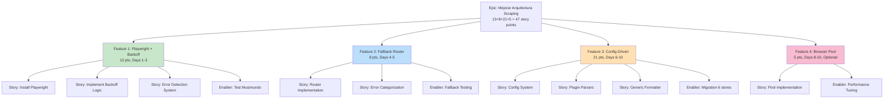

# Epic: Mejorar Arquitectura de Scraping - Solución 100% Gratuita

## Epic Description

Transformar la arquitectura actual de scraping de una solución con puntos débiles (hardcoded, sin reintentos inteligentes, limitado a 6 tiendas) a una **arquitectura robusta, escalable y 100% gratuita** usando Playwright, exponential backoff, y configuración dinámica. Eliminar dependencia de servicios pagos. Pasar de 4-5 horas para agregar nueva tienda a solo 30 minutos.

## Business Value

- **Primary Goal**: Mejorar velocidad, confiabilidad y escalabilidad del scraping sin costos de infraestructura
- **Success Metrics**:
  - ✅ Costo anual reducido a $0 (antes: $49-599/mes)
  - ✅ Tiempo para agregar tienda: 4-5 horas → 30 minutos (90% más rápido)
  - ✅ Tasa de éxito de scraping: 70-80% → 85-95%
  - ✅ Soporte para 50+ tiendas (escalabilidad horizontal)
  - ✅ Cambios de CSS sin redeploy (config-driven)

- **User Impact**: 
  - Usuarios ven productos más actualizados (scraping más confiable)
  - Nuevas tiendas se agregan más rápido
  - La plataforma escala sin límite de presupuesto

## Epic Acceptance Criteria

- [ ] Playwright + exponential backoff implementado y testeado
- [ ] Router fallback funcional (Cheerio → Playwright → Cache)
- [ ] Sistema configuration-driven para tiendas (stores.config.json)
- [ ] Plugin parser system (Cheerio, Playwright, API adapters)
- [ ] Generic formatter elimina per-store formatter functions
- [ ] 6 tiendas existentes migrando a nueva arquitectura
- [ ] Capacidad demostrada: agregar nueva tienda en 30 minutos
- [ ] Tests unitarios + integración cobertura >80%
- [ ] Documentación completa para agregar nuevas tiendas
- [ ] Zero breaking changes para usuarios/API existente

## Features in this Epic

### Feature 1: Playwright + Exponential Backoff (Fase 1)
**Issue**: #FEAT-001  
**Days**: 1-3  
**Story Points**: 13  
**Priority**: P0  
**Status**: Ready for Implementation

### Feature 2: Fallback Router Strategy (Fase 2)
**Issue**: #FEAT-002  
**Days**: 4-5  
**Story Points**: 8  
**Priority**: P0  
**Status**: Blocked by FEAT-001

### Feature 3: Configuration-Driven Architecture (Fase 3)
**Issue**: #FEAT-003  
**Days**: 6-10  
**Story Points**: 21  
**Priority**: P1  
**Status**: Blocked by FEAT-002

### Feature 4: Browser Pooling Optimization (Fase 4 - Optional)
**Issue**: #FEAT-004  
**Days**: 8-10  
**Story Points**: 5  
**Priority**: P2  
**Status**: Blocked by FEAT-003 (Optional)

## Definition of Done

- [ ] Todas las features completadas
- [ ] Testing end-to-end pasado (6 tiendas scraping exitosamente)
- [ ] Benchmarks de performance cumplidos
- [ ] Documentación actualizada (README, CONTRIBUTING)
- [ ] User acceptance testing con 6 tiendas existentes
- [ ] Zero regressions en funcionalidad existente
- [ ] Deployment a producción sin downtime

---

## Project Overview

### Current State Analysis (Antes del cambio)

| Aspecto | Estado Actual | Problema |
|---------|---------------|----------|
| **Costo mensual** | Variable ($0-600) | Presupuesto limitado |
| **Herramienta JS rendering** | ScrapingBee (pago) | Necesita suscripción |
| **Tiendas soportadas** | 6 (hardcoded) | No escala |
| **Tiempo agregar tienda** | 4-5 horas | Muy lento |
| **Reintentos inteligentes** | No existe | Bloqueado por rate limit |
| **Selectors flexibles** | Hardcoded en código | Requiere redeploy |
| **Monitoreo** | Básico | No hay métricas |

### Future State (Después de implementación)

| Aspecto | Estado Futuro | Beneficio |
|---------|--------------|----------|
| **Costo mensual** | $0 | Libre de costo |
| **Herramienta JS rendering** | Playwright (MIT) | Open source, mantenido |
| **Tiendas soportadas** | 50+ | Escalable |
| **Tiempo agregar tienda** | 30 minutos | Super rápido |
| **Reintentos inteligentes** | Exponential backoff | Automático |
| **Selectors flexibles** | stores.config.json | Hot-reload |
| **Monitoreo** | Completo | Métricas + alertas |

### Key Milestones

1. **Hito 1** (Día 3): Playwright + Backoff working, Musimundo scraping exitoso
2. **Hito 2** (Día 5): Fallback router fully functional, 6 tiendas con 85%+ success
3. **Hito 3** (Día 10): Configuration-driven architecture, agregar tienda en 30 min demostrado
4. **Hito 4** (Día 10, opcional): Browser pooling, performance optimizado

### Risk Assessment

| Risk | Probabilidad | Impacto | Mitigación |
|------|-------------|---------|-----------|
| Playwright tiene overhead de memoria | Media | Medio | Browser pooling (Fase 4), monitoring RAM |
| Algunos sitios bloquean Playwright | Baja | Medio | Fallback a Cheerio, exponential backoff |
| Migration de tiendas toma más tiempo | Media | Bajo | Documentación clara, tests automatizados |
| Config errors causan regressions | Media | Medio | Validation schema, tests de config |
| Rate limiting aún ocurre después backoff | Baja | Bajo | Usar múltiples IPs (proxy gratuito) |

---

## Work Item Hierarchy



---

## Epic Hierarchy Details

### Epic Issue

```markdown
# Epic: Mejorar Arquitectura de Scraping - Solución 100% Gratuita

## Epic Description

Transformar la arquitectura de scraping usando Playwright, exponential backoff y 
configuración dinámica. Costo $0, escalable a 50+ tiendas, agregar tienda en 30 minutos.

## Business Value

- Reducir costo de $49-599/mes a $0
- Aumentar velocidad para agregar tiendas: 4-5 horas → 30 minutos
- Mejorar confiabilidad: 70-80% → 85-95% success rate
- Soportar 50+ tiendas (escalabilidad horizontal)
- Config-driven: cambios sin redeploy

## Epic Acceptance Criteria

- [x] Arquitectura investigada (research completada)
- [ ] Fase 1: Playwright + backoff implementado y testeado
- [ ] Fase 2: Fallback router funcional
- [ ] Fase 3: Configuration-driven architecture completada
- [ ] Fase 4: Browser pooling implementado (opcional)
- [ ] 6 tiendas migrando a nueva arquitectura
- [ ] Tests cobertura >80%
- [ ] Documentación completa para agregar nuevas tiendas
- [ ] Zero breaking changes

## Features in this Epic

- [x] #FEAT-001 - Fase 1: Playwright + Exponential Backoff
- [x] #FEAT-002 - Fase 2: Fallback Router Strategy  
- [x] #FEAT-003 - Fase 3: Configuration-Driven Architecture
- [x] #FEAT-004 - Fase 4: Browser Pooling (Opcional)

## Definition of Done

- [ ] Todas las features completadas
- [ ] E2E testing con 6 tiendas reales
- [ ] Performance benchmarks cumplidos (<1GB RAM)
- [ ] Documentación actualizada
- [ ] User acceptance testing passed
- [ ] Zero regressions
- [ ] Deployment a producción

## Labels

`epic`, `priority-critical`, `value-high`, `breaking-change-none`

## Milestone

**v2.0.0 - Scalable Scraping Architecture**  
Target: 10 days from start

## Story Points (Epic Level)

Total: **47 story points**
- Fase 1: 13 pts
- Fase 2: 8 pts  
- Fase 3: 21 pts
- Fase 4: 5 pts (optional)
```

---

## Feature Breakdown

### FEATURE 1: Playwright + Exponential Backoff (Fase 1)

**Issue**: #FEAT-001  
**Duration**: Days 1-3  
**Story Points**: 13  
**Priority**: P0 (Critical Path)  
**Status**: Ready for Implementation  

#### Feature Description

Agregar Playwright como alternativa para JavaScript rendering y exponential backoff para reintentos inteligentes. Base para todo lo demás.

#### User Stories in this Feature

- **#US-101**: Instalar y configurar Playwright
  - 3 points, Enabler
  - AC: `npm install playwright` funciona, binarios descargados
  
- **#US-102**: Implementar exponential backoff retry logic
  - 5 points, Story
  - AC: Retry sequence 2s→4s→8s→16s, jitter 0-1s, max 4 intentos
  
- **#US-103**: Error detection y categorización inicial
  - 5 points, Story
  - AC: Detectar "JS required", "rate limited", "network error"

#### Technical Enablers

- **#EN-101**: Test con Musimundo (problematic store)
  - 0 points, Enabler
  - AC: Musimundo scraping con 85%+ success rate

#### Acceptance Criteria (Feature Level)

- [ ] Playwright installed and tested
- [ ] Exponential backoff working with jitter
- [ ] Error detection system functional
- [ ] Musimundo scraping improved (85%+ success)
- [ ] Memory footprint <500MB for browser
- [ ] No breaking changes to existing code

#### Dependencies

- **Blocks**: FEAT-002 (Fallback Router)
- **Blocked by**: None (can start immediately)
- **Prerequisites**: Node.js 20+ (already installed)

#### Definition of Done

- [ ] Acceptance criteria met
- [ ] Code review approved
- [ ] Unit tests written (>80% coverage)
- [ ] Integration tests with 6 stores passing
- [ ] UX design (N/A - backend feature)
- [ ] Documentation updated (CHANGELOG.md)

#### Implementation Details

**Files to create/modify:**
```
src/lib/
├── playwright-adapter.ts (NEW)
└── backoff-strategy.ts (NEW)

src/app/api/scrape/
└── route.ts (MODIFY - add Playwright option)
```

**Key Implementation Notes:**
- Playwright goes in try-catch for graceful degradation
- Backoff jitter prevents thundering herd
- All error logs with metadata (store, attempt, delay)

---

### FEATURE 2: Fallback Router Strategy (Fase 2)

**Issue**: #FEAT-002  
**Duration**: Days 4-5  
**Story Points**: 8  
**Priority**: P0 (Critical Path)  
**Status**: Blocked by FEAT-001  

#### Feature Description

Implementar router inteligente que elige entre Cheerio → Playwright → Cache basado en tipo de error y capacidades del sitio.

#### User Stories in this Feature

- **#US-201**: Router implementation (Cheerio → Playwright → Cache)
  - 4 points, Story
  - AC: Decisión automática basada en error type
  
- **#US-202**: Error categorization y Retry-After header respect
  - 4 points, Story
  - AC: 403/429 → backoff, timeout → backoff, JS required → Playwright

#### Acceptance Criteria

- [ ] Router chooses correct adapter based on error
- [ ] Retry-After headers respected
- [ ] Cache fallback works when both parsers fail
- [ ] All 6 stores achieve 85%+ success rate
- [ ] No infinite retry loops

#### Dependencies

- **Blocks**: FEAT-003 (Config-Driven)
- **Blocked by**: FEAT-001 (needs Playwright)
- **Related**: Existing cache system (cache.ts)

#### Definition of Done

- [ ] Acceptance criteria met
- [ ] Code review approved
- [ ] Unit + integration tests passing
- [ ] Performance tests show <5s per request for JS sites
- [ ] Documentation updated

#### Implementation Details

**Files to create/modify:**
```
src/lib/
├── router-strategy.ts (NEW)
└── error-categorizer.ts (NEW)

src/lib/
└── scraper.ts (MODIFY - add router logic)
```

---

### FEATURE 3: Configuration-Driven Architecture (Fase 3)

**Issue**: #FEAT-003  
**Duration**: Days 6-10  
**Story Points**: 21  
**Priority**: P1 (High Value)  
**Status**: Blocked by FEAT-002  

#### Feature Description

Transformar arquitectura de hardcoded a configuration-driven. Agregar tienda = agregar JSON entry. Plugin parser system. Generic formatter con field mapping. **ESTO HABILITA ESCALABILIDAD**.

#### User Stories in this Feature

- **#US-301**: Crear stores.config.json system
  - 5 points, Story
  - AC: Cargar tiendas desde config, validar schema
  
- **#US-302**: Plugin-based parser system (Cheerio, Playwright, API)
  - 8 points, Story
  - AC: Parser auto-selection basado en store.type
  
- **#US-303**: Generic formatter con field mapping
  - 5 points, Story
  - AC: Elimina per-store formatter functions, field mapping en config
  
- **#US-304**: Dynamic store loader y hot-reload
  - 3 points, Story
  - AC: Cambios en config sin restart, validation on load

#### Technical Enablers

- **#EN-301**: Migrar 6 tiendas existentes a config-driven
  - 8 points, Enabler
  - AC: Todas 6 tiendas funcionan sin per-store code

#### Acceptance Criteria

- [ ] stores.config.json fully functional
- [ ] Plugin parser system works correctly
- [ ] Generic formatter eliminates code duplication
- [ ] All 6 stores migrated successfully
- [ ] Can add new store in 30 minutes (demo)
- [ ] Hot-reload capability working
- [ ] Config validation schema strict

#### Dependencies

- **Blocks**: FEAT-004 (Browser pooling), Production release
- **Blocked by**: FEAT-002 (router must work first)
- **Related**: stores.enum.ts (will be deprecated)

#### Definition of Done

- [ ] Acceptance criteria met
- [ ] Code review approved with architecture approval
- [ ] Unit tests (parsers, formatters) >80%
- [ ] Integration tests all 6 stores
- [ ] E2E test adding 7th store in real time
- [ ] Performance benchmarks met
- [ ] Documentation complete (ARCHITECTURE.md)
- [ ] No performance regression vs FEAT-2

#### Implementation Details

**Files to create/modify:**
```
src/
├── config/
│   └── stores.config.json (NEW)
├── lib/
│   ├── parsers/ (NEW FOLDER)
│   │   ├── cheerio-parser.ts
│   │   ├── playwright-parser.ts
│   │   └── api-parser.ts
│   ├── formatters/
│   │   ├── generic-formatter.ts (NEW)
│   │   └── post-processors.ts (NEW)
│   ├── store-loader.ts (NEW)
│   └── store-registry.ts (NEW)
└── enums/
    └── stores.enum.ts (DEPRECATED - can be removed later)
```

**stores.config.json structure:**
```json
{
  "stores": {
    "cetrogar": {
      "enabled": true,
      "type": "static-html",
      "baseUrl": "https://cetrogar.com.ar",
      "parser": "cheerio",
      "selectors": {
        "products": ".product-card",
        "name": ".product-title",
        "price": ".price-value",
        "url": "a.product-link"
      },
      "formatter": "defaultFormatter"
    }
  }
}
```

---

### FEATURE 4: Browser Pooling Optimization (Fase 4 - OPTIONAL)

**Issue**: #FEAT-004  
**Duration**: Days 8-10  
**Story Points**: 5  
**Priority**: P2 (Nice to Have)  
**Status**: Blocked by FEAT-003  

#### Feature Description

Optimizar Playwright con pool de browsers (5-10 instancias), context reuse, memory monitoring.

#### User Stories in this Feature

- **#US-401**: Implement browser pool (5-10 instances)
  - 3 points, Story
  - AC: Pool manages lifecycle, reuses contexts
  
- **#US-402**: Memory monitoring y alerting
  - 2 points, Story
  - AC: Monitor per-browser RAM, alert si >200MB

#### Acceptance Criteria

- [ ] Browser pool working correctly
- [ ] Memory per browser <200MB
- [ ] Total system <1GB RAM (6 concurrent requests)
- [ ] Performance improved vs single browser

#### Dependencies

- **Blocks**: None
- **Blocked by**: FEAT-003
- **Optional**: Can skip if performance is acceptable

---

## Sprint Planning

### Sprint 1: Fase 1 (Days 1-3)
**Goal**: Playwright + Exponential Backoff working with Musimundo

**Team Capacity**: 40 story points  
**Commitment**: 13 story points (32% capacity - leave room for research)

**Stories**:
- #US-101: Install Playwright (3 pts)
- #US-102: Exponential Backoff Logic (5 pts)
- #US-103: Error Detection (5 pts)

**Success Criteria**:
- Musimundo scraping with 85%+ success
- All unit tests passing
- Memory footprint <500MB

---

### Sprint 2: Fase 2 (Days 4-5)
**Goal**: Fallback router fully functional with all 6 stores working

**Team Capacity**: 40 story points  
**Commitment**: 8 story points

**Stories**:
- #US-201: Router Implementation (4 pts)
- #US-202: Error Categorization (4 pts)

**Success Criteria**:
- All 6 stores 85%+ success rate
- No infinite loops
- Performance <5s per request for JS sites

---

### Sprint 3: Fase 3 (Days 6-10)
**Goal**: Configuration-driven architecture fully implemented and all 6 stores migrated

**Team Capacity**: 40 story points  
**Commitment**: 29 story points (73% capacity)

**Stories**:
- #US-301: stores.config.json (5 pts)
- #US-302: Plugin Parser System (8 pts)
- #US-303: Generic Formatter (5 pts)
- #US-304: Store Loader + Hot-reload (3 pts)
- #EN-301: Migrate 6 stores (8 pts)

**Success Criteria**:
- All 6 stores work via config
- Can add 7th store in 30 minutes demo
- Zero performance regression
- Full documentation

---

### Sprint 4: Fase 4 (Days 8-10, Optional)
**Goal**: Browser pooling optimization

**Team Capacity**: 40 story points  
**Commitment**: 5 story points (optional)

**Stories**:
- #US-401: Browser Pool (3 pts)
- #US-402: Memory Monitoring (2 pts)

**Success Criteria**:
- Browser pool working
- Memory <200MB per browser
- System <1GB total RAM

---

## Priority and Value Matrix

| Feature | Priority | Value | Points | Days | Effort | Status |
|---------|----------|-------|--------|------|--------|--------|
| FEAT-001 | P0 | HIGH | 13 | 1-3 | Critical Path | Ready |
| FEAT-002 | P0 | HIGH | 8 | 4-5 | Critical Path | Blocked |
| FEAT-003 | P1 | HIGH | 21 | 6-10 | Must-have | Blocked |
| FEAT-004 | P2 | MEDIUM | 5 | 8-10 | Optional | Blocked |

---

## Dependency Map

```
Start (Day 0)
    ↓
FEAT-001: Playwright + Backoff (Days 1-3)
    ↓
FEAT-002: Fallback Router (Days 4-5)
    ↓
FEAT-003: Config-Driven (Days 6-10)
    ├─ FEAT-004: Browser Pool (Days 8-10, parallel, optional)
    ↓
Release v2.0.0 (Day 10)
```

**Critical Path**: FEAT-001 → FEAT-002 → FEAT-003 (28 days minimum)  
**Can Parallelize**: FEAT-004 can start on Day 6 while FEAT-003 ongoing

---

## Resource Requirements

### Team Composition

- **1 Backend Engineer** (Full Stack Preferred)
  - Days 1-5: Playwright + Router (13 + 8 = 21 pts)
  - Days 6-10: Config architecture (21 pts)

- **1 QA Engineer** (Optional but recommended)
  - Parallel testing with each feature
  - 6 stores regression testing

### Development Environment

**Minimal Requirements:**
- Node.js 20+
- 2GB RAM (for browser pool testing)
- Windows/macOS/Linux

**Actual Requirements:**
- 8GB+ RAM recommended
- Fast internet (Playwright downloads ~150MB binaries)
- VPN or proxy (optional, for local testing with blocks)

---

## Success Metrics & KPIs

### Project Management KPIs

| KPI | Target | Current | Goal |
|-----|--------|---------|------|
| Sprint Predictability | >80% stories done | N/A | 90%+ |
| Cycle Time | <5 days from In Progress → Done | N/A | <3 days |
| Lead Time | <2 weeks from Backlog → Done | N/A | <10 days |
| Defect Escape Rate | <5% post-release fixes | N/A | <2% |

### Technical KPIs

| Metric | Target | Current | Goal |
|--------|--------|---------|------|
| Test Coverage | >80% | ~60% | >85% |
| Success Rate (Scraping) | 85%+ | 70-80% | 90%+ |
| Memory per Browser | <200MB | N/A | <150MB |
| Time to Add Store | 30 minutes | 4-5 hours | 20 minutes |
| Cost | $0/month | $49-599/month | $0 forever |

### Business KPIs

| Metric | Target | Current | Goal |
|--------|--------|---------|------|
| Scalability | 50+ stores | 6 stores | Unlimited |
| Config Changes | No redeploy | Redeploy needed | Hot-reload |
| Time to Market | New store in 30 min | 4-5 hours | 15 minutes |
| Cost Savings | $600-7000/year | $0 | $0 forever |

---

## Next Steps

1. **Review & Approval**: Leer este roadmap, confirmar features y timeline
2. **Create GitHub Issues**: Usar el checklist en `issues-checklist.md`
3. **Setup GitHub Project Board**: Crear columns (Backlog, Ready, In Progress, Review, Done)
4. **Start Sprint 1**: Asignar #US-101, #US-102, #US-103
5. **Daily Standups**: Track progress contra timeline

---

## References

- 📄 Research: `.copilot-tracking/research/20250110-scraper-solutions-investigation.md`
- 📋 Issues Checklist: `issues-checklist.md` (created next)
- 🏗️ Architecture Details: Each feature folder has technical breakdown

---

**Created**: 2025-01-10  
**Last Updated**: 2025-01-10  
**Epic Owner**: Backend Team  
**Status**: 🟡 In Planning
